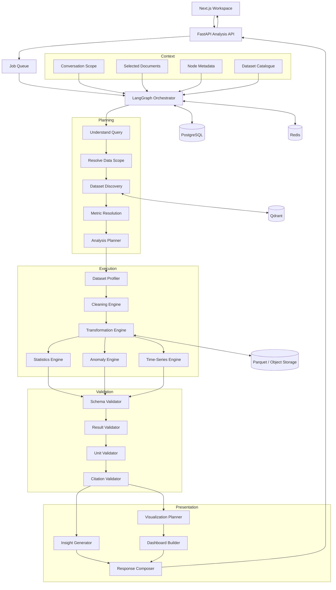
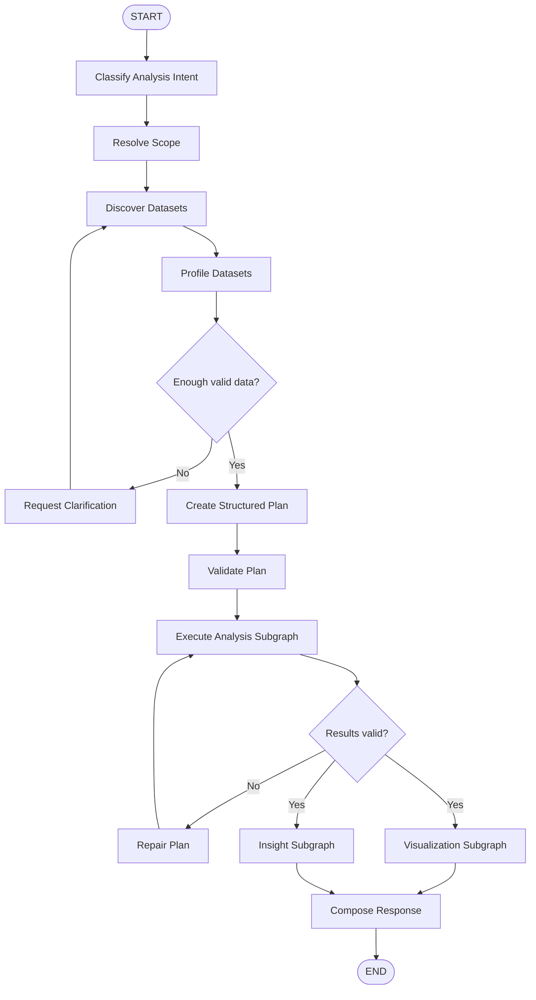
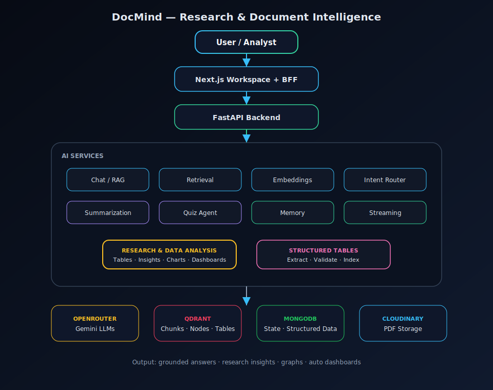
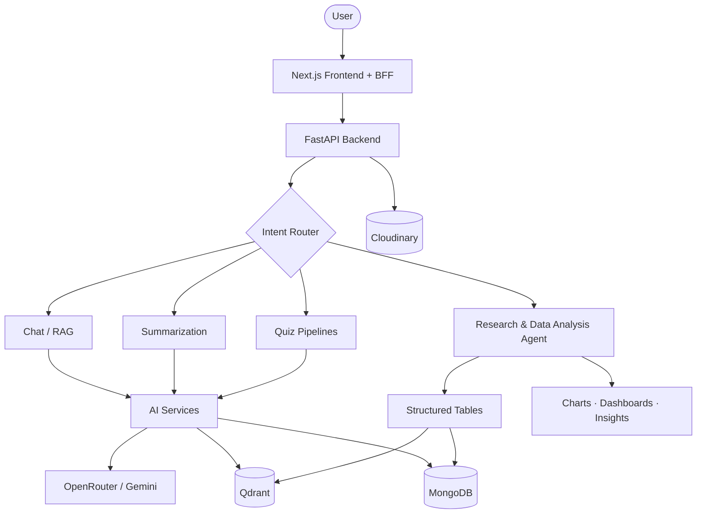
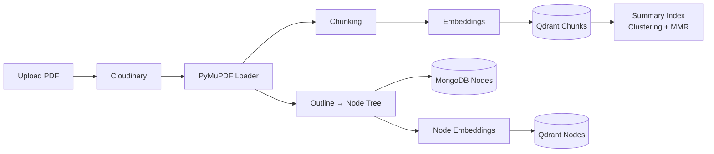
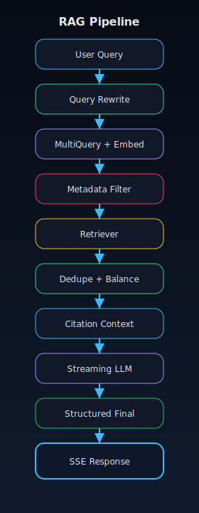
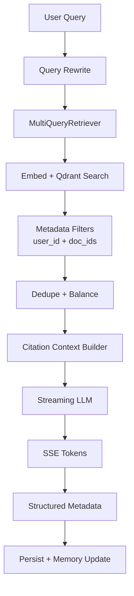
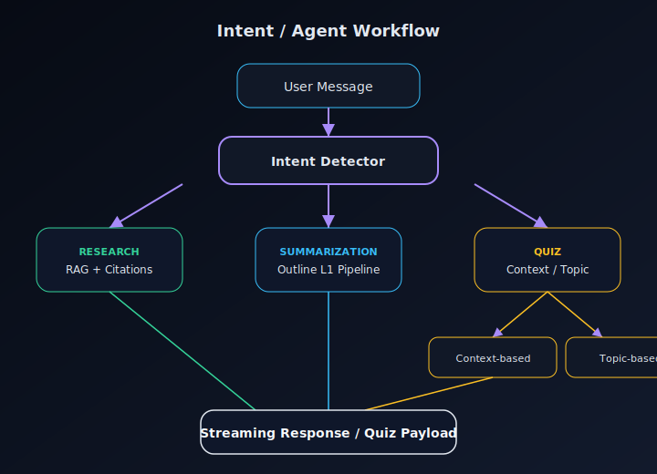
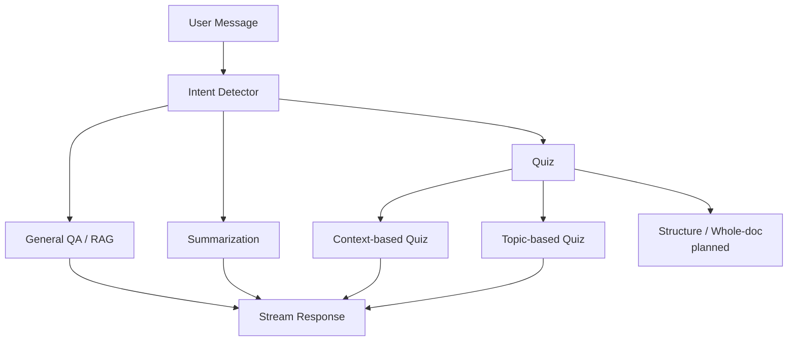

# DocMind AI

**An enterprise-grade document intelligence platform that unifies Retrieval-Augmented Generation (RAG), a research & data-analysis agent, structured table extraction, chart/dashboard generation, and interactive learning into one workspace.**

[](https://nextjs.org/)
[](https://fastapi.tiangolo.com/)
[](https://www.langchain.com/)
[](https://qdrant.tech/)
[](https://www.mongodb.com/)
[](https://clerk.com/)
[](https://aayushroopchandani.github.io/DocMind-AI-Intelligent-conversations-with-documents/)
[](#license)

<p align="center">
  <a href="#features">Features</a> ·
  <a href="#tech-stack">Tech Stack</a> ·
  <a href="#architecture">Architecture</a> ·
  <a href="https://aayushroopchandani.github.io/DocMind-AI-Intelligent-conversations-with-documents/">Interactive Map</a> ·
  <a href="#ai-services">AI Services</a> ·
  <a href="#installation">Installation</a>
</p>

---

DocMind is built for **research and decision-making over documents** — not just Q&A.

Upload PDFs (reports, filings, research papers), then:

- **Ask grounded questions** with citation-backed streaming answers  
- **Extract and index structured tables** for quantitative analysis  
- **Run research & data-analysis workflows** that profile datasets, compute insights, and generate **graphs, charts, and dashboards**  
- **Summarize** outline-aware sections and **quiz** yourself across practice / rapid-fire / exam modes  

> **Interactive architecture:** [Open the animated system map →](https://aayushroopchandani.github.io/DocMind-AI-Intelligent-conversations-with-documents/)  
> Deep-dive docs: [`docs/architecture/`](docs/architecture/)

---

### Research & Data Analysis Agent — system view



### Research & Data Analysis Agent — execution flow



---
    
## Features

### Research & Data Analysis

| Capability | Description |
| --- | --- |
| **Structured table extraction** | Pull tables from PDFs (PyMuPDF) into normalized `structured_tables` with typed columns, units, and page provenance |
| **Docling fallback recovery** | Coverage detection + isolated Docling worker recovers missed / complex tables |
| **Table validation** | Schema, quality, and consistency checks before indexing |
| **Table semantic index** | LLM summaries + keywords embedded into Qdrant for dataset discovery |
| **Research & analysis agent** | LangGraph-oriented workflows: scope → discover → profile → plan → execute → visualize |
| **Charts & dashboards** | Visualization planner + dashboard builder turn quantitative findings into graphs and auto-composed views |
| **Grounded insights** | Analysis results stay tied to source pages / table fragments for citation |

### Conversational RAG

| Capability | Description |
| --- | --- |
| **Multi-document RAG** | Ask questions across up to 4 PDFs in one chat with per-user, per-document Qdrant filters |
| **Intent routing** | Detects `general_qa`, `summarization`, or `quiz` and dispatches specialized pipelines |
| **Semantic search** | OpenAI `text-embedding-3-small` embeddings stored in Qdrant |
| **Multi-query retrieval** | LangChain `MultiQueryRetriever` expands queries for better recall |
| **Query rewriting** | Follow-ups (“does it apply to interns?”) become standalone retrieval queries |
| **Citation-based answers** | Inline `[C1]` markers mapped to filename + page + excerpt |
| **Streaming responses** | Server-Sent Events (`status` → `token` → `citations` → `final` → `done`) |
| **Conversation memory** | Rolling chat summary + recent verbatim messages |
| **Context balancing** | Deduplicate chunks, cap per-document contribution, enforce token budget |
| **Structured enrichment** | Confidence, answer status, follow-ups, and per-document contributions |
| **Outline-aware summarization** | TOC/node tree, hybrid node search, representative chunks, hierarchical map-reduce |
| **Quiz generation** | Context-based and topic-based quizzes with multiple formats and modes |

### Document Intelligence

- PDF upload (PDF-only, max 4 per chat)
- Cloudinary private storage with secure URLs
- PyMuPDF parsing + RecursiveCharacterTextSplitter chunking
- PDF outline / TOC → hierarchical **node tree**
- Chunk metadata: `user_id`, `doc_id`, `node_id`, page, chunk order
- Dual Qdrant collections: **chunks** + **nodes** (+ table summaries)
- Background summary-index build (clustering + MMR representatives)
- Incremental document attach / detach from chats
- Content-hash (`SHA-256`) document identity to avoid duplicate storage

### Learning & Assessment

- **Practice mode** — guided quiz with explanations
- **Rapid-fire mode** — timed question bursts
- **Exam mode** — timed exam with browser proctoring (tab/window focus monitoring)
- Question formats: single MCQ, multiple-correct MCQ, true/false, fill-in-the-blank, match-the-following
- Difficulty levels: easy / medium / hard
- Citation chips linking quiz items back to source pages

### Platform

- Clerk authentication (sign-in / sign-up)
- User sync into MongoDB on login
- Per-user chat history and workspaces
- Split-screen PDF viewer + chat (desktop); tabbed Documents / Chat (mobile)
- Citation click → jump to page in the viewer
- Real-time SSE streaming UI with Markdown rendering
- Dark-mode product UI
- Next.js BFF proxy — browser never talks to FastAPI with secrets
- Internal API secret between Next.js and FastAPI

---

## Tech Stack

| Layer | Technology | Purpose |
| --- | --- | --- |
| Frontend | Next.js 16, React 19, TypeScript | App router UI, BFF API routes, streaming client |
| UI | Tailwind CSS 4, shadcn/ui, GSAP, react-pdf | Design system, motion, in-browser PDF viewing |
| Auth | Clerk | Session management, protected `/chat` routes |
| Backend API | FastAPI, Uvicorn, Pydantic | REST + SSE endpoints |
| Orchestration | LangChain + LangGraph (analysis agent) | Retrievers, LLM wrappers, multi-step research/analysis graphs |
| LLMs | OpenRouter → Gemini 2.5 Flash / Flash-Lite | Answers, utilities, intent, quizzes, summaries, table metadata |
| Embeddings | OpenAI `text-embedding-3-small` | Chunk (1536-d), node (512-d), and table-summary vectors |
| Vector DB | Qdrant (embedded path or remote) | Semantic retrieval, node search, table discovery |
| Document DB | MongoDB (Motor async) | Users, chats, documents, quizzes, memory, structured tables |
| Object storage | Cloudinary | Private PDF hosting |
| PDF parsing | PyMuPDF + Docling (fallback) | Text, outline tree, table extraction / recovery |
| ML helpers | NumPy, scikit-learn | Clustering / MMR for summary representatives |

---

## Architecture

<p align="center">
  <a href="https://aayushroopchandani.github.io/DocMind-AI-Intelligent-conversations-with-documents/">
    <strong>Launch interactive architecture map →</strong>
  </a>
</p>

Glowing nodes, animated flow lines, zoom/pan, and clickable service details live on the hosted map. Static diagrams for the README are below; written deep-dives are in [`docs/architecture/`](docs/architecture/).

### System overview

<p align="center">
  
</p>

<details>
<summary>Mermaid version</summary>



</details>

### AI services map

<p align="center">
  
</p>

### Document ingestion

<p align="center">
  
</p>

<details>
<summary>Mermaid version</summary>



</details>

### RAG pipeline

<p align="center">
  
</p>

<details>
<summary>Mermaid version</summary>



</details>

### Intent / agent workflow

<p align="center">
  
</p>

<details>
<summary>Mermaid version</summary>



</details>

---

## AI Services

<details>
<summary><strong>Embedding Service</strong></summary>

- **Purpose:** Convert PDF chunks and outline nodes into vectors for Qdrant.
- **Models:** `text-embedding-3-small` (chunks 1536-d, nodes 512-d).
- **Input:** Chunk / node text.
- **Output:** Dense vectors + payload metadata (`user_id`, `doc_id`, `node_id`, pages).
- **Location:** `backend/utils/embeddings.py`, `backend/qdrant_manager.py`.

</details>

<details>
<summary><strong>Retrieval Service</strong></summary>

- **Purpose:** Fetch grounded context for Q&A.
- **Flow:** Rewrite query → MultiQuery expansion → filtered Qdrant search → dedupe → per-doc balancing → token budget.
- **Filters:** Always scoped to the authenticated `user_id` and selected `doc_id`s.
- **Location:** `backend/scripts/chat_with_pdf.py`, `backend/utils/format_document.py`.

</details>

<details>
<summary><strong>Chat Service</strong></summary>

- **Purpose:** Stream grounded answers with citations.
- **LLM:** Gemini 2.5 Flash via OpenRouter (streaming).
- **Events:** `status`, `token`, `citations`, `final`, `error`, `done`.
- **Location:** `backend/scripts/chat_with_pdf.py` → `ask_question()`.

</details>

<details>
<summary><strong>Intent Detection</strong></summary>

- **Purpose:** Route each message to the right pipeline.
- **Intents:** `general_qa` | `summarization` | `quiz`.
- **Method:** Regex heuristics + LLM structured classification.
- **Location:** `backend/scripts/intent_detection/`.

</details>

<details>
<summary><strong>Summarization Pipeline</strong></summary>

- **Purpose:** Outline-aware, budgeted summaries for chapters/sections/topics.
- **Highlights:** Hybrid node search, scope budgets, representative selection (clustering + MMR), hierarchical map-reduce, parallel LLM calls.
- **Location:** `backend/scripts/intention_pipelines/summarization_pipeline/`.

</details>

<details>
<summary><strong>Quiz Pipelines</strong></summary>

- **Purpose:** Generate citation-linked quizzes from conversation context or topics.
- **Scopes live today:** `context_based`, `topic_based`.
- **Modes:** practice, rapid_fire, exam_mode.
- **Location:** `backend/scripts/intention_pipelines/quiz_pipeline/`.

</details>

<details>
<summary><strong>Memory</strong></summary>

- **Purpose:** Keep long chats coherent without blowing the context window.
- **Design:** Last *N* messages verbatim + rolling summary refreshed every *M* new messages.
- **Tunables:** `MEMORY_RECENT_MESSAGES`, `MEMORY_SUMMARY_EVERY`.
- **Storage:** `chat.memory` in MongoDB.

</details>

<details>
<summary><strong>Prompt Templates</strong></summary>

- Answer generation (system + human) with strict grounding rules
- Standalone query rewrite
- Rolling conversation summary
- Response metadata enrichment
- **Location:** `backend/utils/prompts.py`

</details>

<details>
<summary><strong>Streaming</strong></summary>

- FastAPI `StreamingResponse` with `text/event-stream`
- Next.js route proxies SSE to the browser
- UI renders progressive Markdown + citation cards

</details>

---

## Folder Structure

```text
DocMind-AI-Intelligent-conversations-with-documents/
├── README.md
├── SETUP_CLOUDINARY_MONGODB.md
├── assets/
│   └── architecture/                  # SVG diagrams embedded in README
├── docs/
│   ├── index.html                     # GitHub Pages — interactive map
│   └── architecture/                  # Deep-dive docs + architecture.html
├── backend/
│   ├── main.py                        # FastAPI app + CORS + routers
│   ├── requirements.txt
│   ├── qdrant_manager.py              # Qdrant clients + vector stores
│   ├── apis/
│   │   ├── chats.py                   # Chats, PDF upload, SSE stream
│   │   ├── documents.py               # Node / summary-index status
│   │   ├── users.py                   # Clerk → Mongo sync
│   │   └── deps.py                    # Auth headers + internal secret
│   ├── config/settings.py             # Env-backed settings
│   ├── db/
│   │   ├── mongodb.py
│   │   ├── crud.py
│   │   └── models/                    # User, Chat, Document, Quiz
│   ├── scripts/
│   │   ├── ingest.py                  # PDF → chunks → Qdrant
│   │   ├── chat_with_pdf.py           # RAG ask_question pipeline
│   │   ├── intent_detection/          # Intent router
│   │   ├── data_analysis_agent/       # Tables · research · charts pipeline
│   │   └── intention_pipelines/
│   │       ├── summarization_pipeline/
│   │       └── quiz_pipeline/
│   ├── services/cloudinary_setup.py
│   ├── utils/                         # Embeddings, prompts, schemas
│   └── tests/
└── frontend/
    └── my-app/
        ├── app/                       # Next.js App Router
        │   ├── (auth)/                # Sign-in / sign-up
        │   ├── chat/                  # Workspace
        │   ├── quiz/                  # Practice / rapid-fire / exam
        │   └── api/                   # BFF proxies to FastAPI
        ├── components/
        │   ├── chat/                  # Workspace, viewer, streaming UI
        │   ├── quiz/                  # Quiz experiences
        │   ├── home/                  # Marketing landing
        │   └── ui/                    # shadcn primitives
        ├── lib/                       # API client, types, quiz helpers
        └── proxy.ts                   # Clerk middleware (Next 16)
```

---

## Installation

### Prerequisites

- Python **3.11+**
- Node.js **20+**
- MongoDB (local or Atlas)
- Cloudinary account
- OpenAI API key (embeddings)
- OpenRouter API key (LLMs)
- Clerk application (auth)
- Optional: Docker for remote Qdrant (`docker run -p 6333:6333 qdrant/qdrant`)

### 1. Clone

```bash
git clone https://github.com/aayushroopchandani/DocMind-AI-Intelligent-conversations-with-documents.git
cd DocMind-AI-Intelligent-conversations-with-documents
```

### 2. Backend

```bash
cd backend
python -m venv .venv
source .venv/bin/activate   # Windows: .venv\Scripts\activate
pip install -r requirements.txt
```

### 3. Frontend

```bash
cd frontend/my-app
npm install
```

---

## Environment Variables

### Backend (`backend/.env`)

| Variable | Description | Required |
| --- | --- | --- |
| `MONGODB_URI` | MongoDB connection string | Yes |
| `MONGODB_DB_NAME` | Database name (default `docmind`) | Yes |
| `CLOUDINARY_CLOUD_NAME` | Cloudinary cloud name | Yes |
| `CLOUDINARY_API_KEY` | Cloudinary API key | Yes |
| `CLOUDINARY_API_SECRET` | Cloudinary API secret | Yes |
| `OPENAI_API_KEY` | Embeddings (`text-embedding-3-small`) | Yes |
| `OPENROUTER_API_KEY` | LLM access via OpenRouter | Yes |
| `QDRANT_COLLECTION_NAME` | Chunk vector collection | Yes |
| `QDRANT_COLLECTION_NAME_NODES` | Node vector collection | Yes |
| `QDRANT_PATH` | Embedded Qdrant storage path (or use URL/HOST) | No* |
| `QDRANT_URL` / `QDRANT_HOST` / `QDRANT_PORT` / `QDRANT_API_KEY` | Remote Qdrant | No* |
| `MAX_PDFS_PER_CHAT` | Upload cap (default `4`) | No |
| `INTERNAL_API_SECRET` | Shared secret with Next.js BFF | Recommended |
| `MEMORY_RECENT_MESSAGES` | Verbatim memory window (default `6`) | No |
| `MEMORY_SUMMARY_EVERY` | Summary refresh cadence (default `6`) | No |
| `RETRIEVAL_CANDIDATES_PER_DOC` | Candidates before balancing | No |
| `RETRIEVAL_FINAL_CHUNKS` | Final context chunk count | No |
| `RETRIEVAL_MAX_PER_DOC` | Max chunks per PDF | No |
| `RETRIEVAL_MAX_CONTEXT_TOKENS` | Context token budget | No |
| `SUMMARY_*` | Summarization budget / parallelism knobs | No |
| `DATA_ANALYSIS_TABLE_SUMMARY_MODEL` | Small table-summary model (default `google/gemini-2.5-flash-lite`) | No |
| `DATA_ANALYSIS_TABLE_SUMMARY_CONCURRENCY` | Parallel table-summary calls (default `8`) | No |
| `DATA_ANALYSIS_TABLE_SUMMARY_ATTEMPTS` | Per-table structured-output attempts (default `3`) | No |
| `DATA_ANALYSIS_DOCLING_ENABLED` | Run conditional missed-table fallback (default `true`) | No |
| `DATA_ANALYSIS_DOCLING_PYTHON` | Dedicated Python executable containing Docling | When enabled |
| `DATA_ANALYSIS_DOCLING_TABLE_MODE` | `accurate` (default) or `fast` | No |
| `DATA_ANALYSIS_DOCLING_THREADS` | CPU threads used by the isolated worker (default `4`) | No |
| `DATA_ANALYSIS_DOCLING_DEVICE` | Worker inference device (default `cpu`) | No |
| `DATA_ANALYSIS_DOCLING_PAGE_PADDING` | Context pages around flagged runs (default `1`) | No |
| `DATA_ANALYSIS_DOCLING_MAX_PAGES_PER_JOB` | Maximum pages in one fallback range (default `12`) | No |

\* Provide either `QDRANT_PATH` (default embedded) **or** remote URL/host settings.

### Frontend (`frontend/my-app/.env`)

| Variable | Description | Required |
| --- | --- | --- |
| `NEXT_PUBLIC_CLERK_PUBLISHABLE_KEY` | Clerk publishable key | Yes |
| `CLERK_SECRET_KEY` | Clerk secret key | Yes |
| `NEXT_PUBLIC_CLERK_SIGN_IN_URL` | Sign-in path | Yes |
| `NEXT_PUBLIC_CLERK_SIGN_UP_URL` | Sign-up path | Yes |
| `NEXT_PUBLIC_CLERK_SIGN_IN_FALLBACK_REDIRECT_URL` | Post sign-in redirect | Yes |
| `NEXT_PUBLIC_CLERK_SIGN_UP_FALLBACK_REDIRECT_URL` | Post sign-up redirect | Yes |
| `BACKEND_URL` | FastAPI base URL (e.g. `http://localhost:8000`) | Yes |
| `INTERNAL_API_SECRET` | Must match backend when set | Recommended |

> See also [`SETUP_CLOUDINARY_MONGODB.md`](SETUP_CLOUDINARY_MONGODB.md) for a detailed verification walkthrough.

---

## Running Locally

**Terminal 1 — Backend**

```bash
cd backend
source .venv/bin/activate
uvicorn main:app --reload --port 8000
```

**Terminal 2 — Frontend**

```bash
cd frontend/my-app
npm run dev
```

Open [http://localhost:3000](http://localhost:3000) → sign in → create a chat → upload PDFs → ask.

API docs (when backend is up): [http://localhost:8000/docs](http://localhost:8000/docs)

### Ingest the bundled data-analysis sample

With MongoDB, Cloudinary, OpenAI embeddings, OpenRouter, and Qdrant configured
in `backend/.env`:

```bash
cd backend
source .venv/bin/activate
python -m scripts.data_analysis_agent.run_ingestion
```

Install the optional Docling fallback in a separate environment to keep its
PyTorch/model dependencies out of the FastAPI process:

```bash
cd backend
python3.11 -m venv .docling-venv
.docling-venv/bin/pip install -r requirements-docling.txt
export DATA_ANALYSIS_DOCLING_PYTHON="$PWD/.docling-venv/bin/python"
```

The runner uploads the sample PDF to Cloudinary, records its SHA-256 document
in MongoDB, writes 2400/300 text chunks to `QDRANT_COLLECTION_NAME`, stores
normalized tables in MongoDB's `structured_tables` collection, and writes only
their 1536-dimensional discovery summaries to Qdrant's `structured_tables`
collection. Pass a different PDF path or `--user-id` when needed.
After that primary ingestion is ready, a coordinate-based coverage detector
runs in the background. Only doubtful page ranges are sent to the one-at-a-time
Docling subprocess; OCR, image classification/description, chart extraction,
code/formula enrichment, image generation, plugins, and remote services are
disabled. Recovered unique tables use the same MongoDB, summary, embedding, and
Qdrant paths as PyMuPDF tables.

---

## API Overview

All FastAPI routes are intended to be called by the **Next.js BFF**, not the browser directly. Requests carry:

- `X-User-Id` — Clerk user id (verified by Next.js)
- `X-Internal-Secret` — shared secret (when configured)

| Method | Endpoint | Purpose |
| --- | --- | --- |
| `POST` | `/users/sync` | Upsert Clerk user into MongoDB |
| `POST` | `/chats` | Create a new chat |
| `GET` | `/chats/{chat_id}` | Fetch chat + conversation |
| `GET` | `/chats/{user_id}/chats` | List chats for a user |
| `POST` | `/chats/{chat_id}/pdfs` | Upload PDFs (multipart) → Cloudinary + ingest |
| `DELETE` | `/chats/{chat_id}/pdfs/{document_db_id}` | Detach PDF; delete vectors if unused |
| `GET` | `/chats/{chat_id}/documents` | List documents for a chat |
| `POST` | `/chats/{chat_id}/stream` | SSE: intent → RAG / summary / quiz |
| `GET` | `/documents/{document_id}/nodes` | Outline nodes + summary-index status |
| `GET` | `/documents/{document_id}/nodes/status` | Node ingestion readiness |
| `GET` | `/tables?document_id={sha256}` | Paginated normalized tables for a document |
| `GET` | `/tables/{table_id}` | Fetch one normalized table with source positions |

### SSE event types (`/chats/{chat_id}/stream`)

| Event | Meaning |
| --- | --- |
| `status` | Progress message (“Detecting intent”, “Searching…”) |
| `intent` | Detected intent payload |
| `token` | Streamed answer text |
| `citations` | Citation list for the answer |
| `final` | Structured `DocMindResponse` |
| `quiz` | Generated quiz payload |
| `error` | Recoverable / fatal pipeline error |
| `done` | Stream complete |

---

## Future Improvements

Actively being built on top of the shipped table-ingestion layer (`scripts/data_analysis_agent/`):

- **LangGraph research & data-analysis orchestration** — multi-step plan → execute → repair loops
- **Auto-generated charts & dashboards** — visualization planner + dashboard composer
- Deeper statistics / anomaly / time-series analysis engines
- Structure-based and whole-document quiz scopes (schemas already defined)
- Evaluation harness for retrieval + summarization + analysis faithfulness

Roadmap candidates:

- Excel / CSV analysis agent
- SQL / warehouse agent
- Voice conversations
- Knowledge-graph / GraphRAG overlays
- MCP tool surface for external agents
- Model routing by task cost/latency

---

## Contributing

Contributions are welcome.

1. Fork the repository
2. Create a feature branch: `git checkout -b feature/your-change`
3. Keep changes focused; match existing patterns in `backend/` and `frontend/my-app/`
4. Add or update tests under `backend/tests/` when touching pipelines
5. Open a pull request with a clear summary and test plan

Please do not commit secrets (`.env` files). Use the env tables above as the contract.


## License

This project is available under the **MIT License** — free to use, modify, and distribute with attribution.

---

<p align="center">
  Built for researchers, analysts, and teams who need <strong>grounded answers, structured data, and visual insights</strong> from their documents.
  <br />
  <a href="https://aayushroopchandani.github.io/DocMind-AI-Intelligent-conversations-with-documents/">Open Interactive Architecture →</a>
</p>
