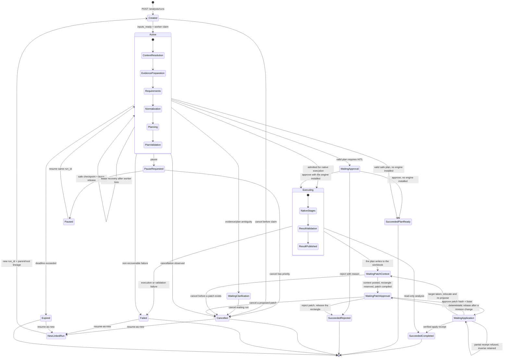
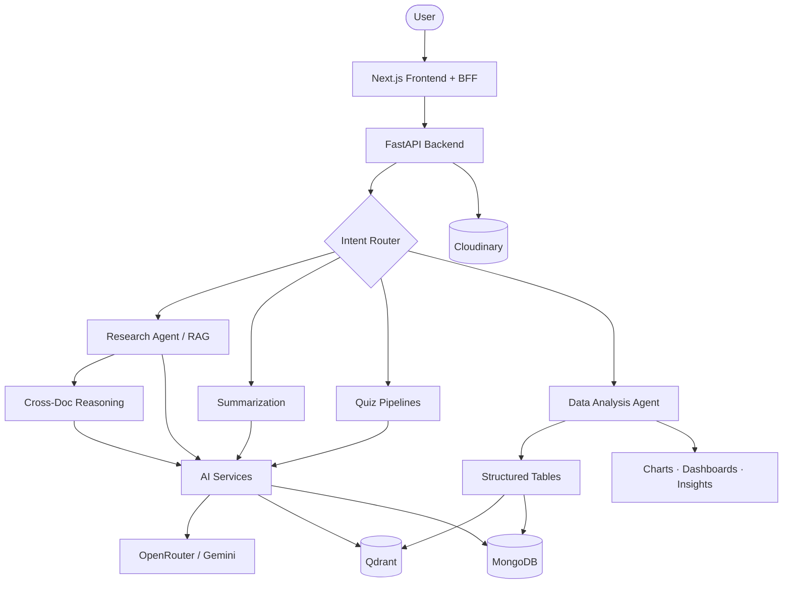
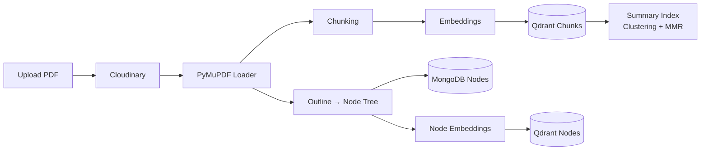
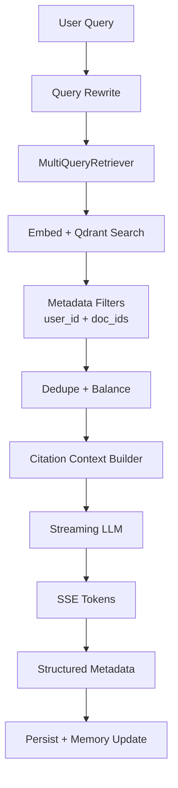
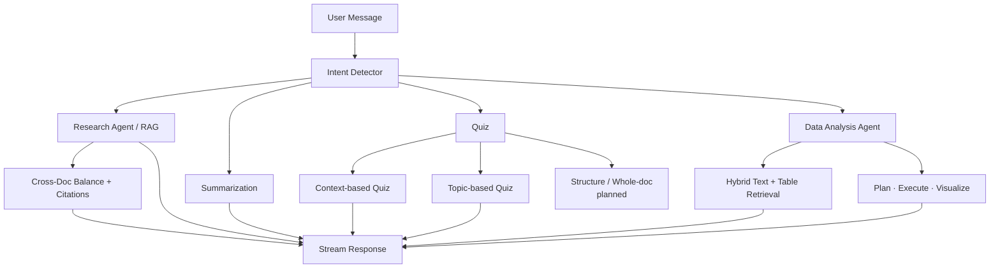

# DocMind AI

**Not just chat-with-PDF.** DocMind is a document intelligence workspace for research agents, data-analysis agents, cross-document reasoning, charts/dashboards, and quantitative analysis — grounded in your PDFs, tables, and citations.

[](https://nextjs.org/)
[](https://fastapi.tiangolo.com/)
[](https://www.langchain.com/)
[](https://www.langchain.com/langgraph)
[](https://qdrant.tech/)
[](https://www.mongodb.com/)
[](https://clerk.com/)
[](https://aayushroopchandani.github.io/DocMind-AI-Intelligent-conversations-with-documents/)
[](#license)

<p align="center">
  <a href="#what-docmind-does">What DocMind Does</a> ·
  <a href="#features">Features</a> ·
  <a href="#tech-stack">Tech Stack</a> ·
  <a href="#architecture">Architecture</a> ·
  <a href="https://aayushroopchandani.github.io/DocMind-AI-Intelligent-conversations-with-documents/">Interactive Map</a> ·
  <a href="#ai-services">AI Services</a> ·
  <a href="#installation">Installation</a>
</p>

---

## What DocMind Does

Upload reports, filings, and papers, then work across four tightly connected capabilities:

| Pillar | What it means in DocMind |
| --- | --- |
| **Research agent** | Multi-step investigation over narrative text — rewrite, expand, retrieve, compare, and compose citation-backed findings |
| **Data analysis agent** | Durable LangGraph workflows over PDF and spreadsheet tables — resolve evidence, profile, normalize, generate typed plans, validate deterministically, and route selective human approval |
| **Cross-document reasoning** | Ask across up to 4 PDFs at once; balance evidence per doc; detect agreement, gaps, and conflicts with page-level citations |
| **Data analysis** | Structured extraction → typed columns / units → semantic table index → versioned plans for transforms, statistics, ML, visualizations, and workbook edits |

Supporting surfaces (outline-aware **summarization**, **quizzes**, PDF viewer) sit on the same ingestion + retrieval stack so learning and review stay grounded in the same evidence.

> **Interactive architecture:** [Open the animated system map →](https://aayushroopchandani.github.io/DocMind-AI-Intelligent-conversations-with-documents/)  
> Deep-dive docs: [`docs/architecture/`](docs/architecture/) · agent deep-dive: [`docs/architecture/data-analysis-agent.md`](docs/architecture/data-analysis-agent.md)

---

### Data Analysis Agent — Phase 8 end-to-end architecture

Phase 8 is implemented at its intended safety boundary. A prompt from the
spreadsheet/PDF workspace now becomes a durable, tenant-scoped run; Phase 1–7
resolve and normalize evidence; an LLM proposes a strict typed plan; and trusted
code canonicalizes, validates, versions, persists, streams, and—only when the
risk policy requires it—asks a human to approve that plan. Raw LLM output never
directly calls spreadsheet APIs.

Solid arrows below represent the main data path. Dashed arrows represent
asynchronous recovery, control, cache, or observability paths.


```mermaid
flowchart TB
    classDef client fill:#0f172a,stroke:#38bdf8,color:#f8fafc,stroke-width:2px
    classDef api fill:#172554,stroke:#60a5fa,color:#eff6ff
    classDef process fill:#132e2a,stroke:#34d399,color:#ecfdf5
    classDef decision fill:#422006,stroke:#fbbf24,color:#fffbeb,stroke-width:2px
    classDef store fill:#2e1065,stroke:#c084fc,color:#faf5ff
    classDef terminal fill:#3f1d2e,stroke:#fb7185,color:#fff1f2
    classDef boundary fill:#1f2937,stroke:#f8fafc,color:#f8fafc,stroke-width:2px

    USER([Analyst]):::client

    subgraph INGEST["A · PDF ingestion and analytical indexing"]
        direction TB
        PDF[PDF upload]:::client --> CLAIM[SHA-256 document identity<br/>tenant ownership · idempotent claim]:::process
        CLAIM --> CLOUDPDF[(Cloudinary<br/>private source PDF)]:::store

        CLAIM --> TEXT[PyMuPDF text and outline extraction<br/>token-aware chunks · pages · node metadata]:::process
        TEXT --> TEXTEMBED[Dense embeddings plus sparse index payloads]:::process
        TEXTEMBED --> QTEXT[(Qdrant<br/>dense and sparse PDF chunks)]:::store
        TEXT --> MDOC[(MongoDB documents<br/>nodes · status · provenance)]:::store

        CLAIM --> PYTABLE[PyMuPDF table extraction<br/>cells · typed columns · page regions]:::process
        PYTABLE --> TQUALITY[Deterministic table validation<br/>accept · quarantine · reject]:::process
        TQUALITY --> TSUMMARY[LLM table discovery summary<br/>short summary · keywords · schema · units]:::process
        TSUMMARY --> MTABLE[(MongoDB structured_tables<br/>authoritative rows and summaries)]:::store
        TSUMMARY --> QTABLE[(Qdrant structured_tables<br/>dense and sparse summary vectors)]:::store

        TQUALITY -. suspicious page ranges .-> COVERAGE[Coverage detector<br/>bounded missed-table ranges]:::process
        COVERAGE --> NEEDDOC{Complex or missed<br/>tables likely?}:::decision
        NEEDDOC -- no --> DOCREADY[Document analysis-ready]:::terminal
        NEEDDOC -. yes .-> DOCLING[Isolated Docling subprocess<br/>dedicated interpreter · bounded pages]:::process
        DOCLING --> DMERGE[Validate · content-dedupe · merge<br/>summarize additions · vector upsert]:::process
        DMERGE --> MTABLE
        DMERGE --> QTABLE
        DMERGE --> DOCREADY
    end

    subgraph FRONTEND["B · Authenticated workspace and request envelope"]
        direction TB
        USER --> COMPOSER[AI analyst composer<br/>ask · analyse · edit<br/>standard · schema_only · local_only]:::client
        COMPOSER --> ACTIVE{Active artifact}:::decision

        ACTIVE -- PDF --> PDFCONTEXT[Resolve/upload selected PDF<br/>immutable document ID · chat ID · current page]:::process
        ACTIVE -- Spreadsheet --> SNAPSHOT[Univer snapshot adapter<br/>selected or bounded used range<br/>values · formulas · types · headers<br/>workbook revision · SHA-256 snapshot hash]:::process
        SNAPSHOT --> SNAPSIZE{Within inline limits?}:::decision
        SNAPSIZE -- yes --> INLINE[Inline bounded workbook context]:::process
        SNAPSIZE -- no --> SNAPUPLOAD[Upload immutable workbook snapshot artifact]:::api

        PDFCONTEXT --> BFF[Clerk-authenticated Next.js BFF<br/>server-derived user identity<br/>internal API secret never reaches browser]:::api
        INLINE --> BFF
        SNAPUPLOAD --> BFF
        COMPOSER --> BFF
        BFF -->|POST /analysis/runs<br/>Idempotency-Key| RUNAPI[FastAPI analysis API<br/>auth · tenant scope · body limits<br/>strict Pydantic request contract]:::api
    end

    subgraph CONTROL["C · Durable run and artifact control plane"]
        direction TB
        RUNAPI --> RUNSVC[AnalysisRunService<br/>request fingerprint · idempotent replay<br/>input deadline · immutable source references]:::process
        RUNSVC --> SOURCEKIND{Input adapter}:::decision

        SOURCEKIND -- PDF IDs --> PDFPIN[Pin selected documents<br/>verify owner and document readiness]:::process
        MDOC --> PDFPIN

        SOURCEKIND -- workbook snapshot --> WBCTX[WorkbookContextService<br/>validate revision/hash/range<br/>detect bounded tables and stable column keys]:::process
        WBCTX --> ARTSVC[ArtifactVersionService<br/>content validation · hash · immutable version<br/>upload verification and reconciliation]:::process
        ARTSVC --> BLOBS[(Cloudinary private artifacts<br/>JSON · CSV · XLSX · workbook snapshots)]:::store
        WBCTX --> CATALOG[(MongoDB dataset_catalog<br/>tenant-scoped versioned handles)]:::store

        PDFPIN --> STATE[AnalysisRunStateMachine<br/>optimistic run version<br/>status + phase + outcome]:::process
        CATALOG --> STATE
        RUNSVC --> STATE
        STATE --> RUNS[(MongoDB analysis_runs<br/>prompt · mode · pinned inputs · lease<br/>versions · approvals · usage · timings)]:::store
        STATE --> EVENTS[(MongoDB analysis_run_events<br/>append-only · monotonic sequence<br/>deduplication key · privacy-safe payload)]:::store

        RUNS -->|inputs_ready| WORKER[DurableAnalysisWorker<br/>poll · claim · fencing token<br/>renew lease · recover abandoned work]:::process
        WORKER --> ADAPTER[Phase7AnalysisAdapter<br/>safe-boundary cancellation/pause checks<br/>bounded milestones · token/timing projection]:::process
    end

    subgraph PHASE7["D · Shared Phase 1–7 evidence pipeline · one contract, multiple adapters"]
        direction TB
        ADAPTER --> GSTART((LangGraph START<br/>isolated by run_id)):::boundary
        GSTART --> RETRIEVE[Evidence retrieval branch]:::process
        GSTART --> REQUIREMENTS[Typed requirements branch<br/>operation · source fields · prediction target<br/>entities · periods · filters · units<br/>document coverage · workbook destination]:::process

        PDFPIN --> RETRIEVE
        CATALOG --> PINNED[Directly pinned spreadsheet evidence<br/>no vector rediscovery of active range]:::process

        RETRIEVE --> QGEN[Query generation<br/>normal or broad scope<br/>shared · text · table queries<br/>table intent and relevance signals]:::process
        QGEN --> RTEXT[PDF text retrieval<br/>user and document filters]:::process
        QGEN --> RTABLE[Table-summary retrieval<br/>user and document filters]:::process
        QTEXT --> RTEXT
        QTABLE --> RTABLE
        RTEXT --> FUSION[Reciprocal-rank fusion<br/>dedupe · balance · diversify · token bound]:::process
        RTABLE --> FUSION

        FUSION --> HYDRATE[Hydrate authoritative datasets<br/>verify tenant · table ID · source version<br/>artifact locator and provenance]:::process
        PINNED --> HYDRATE
        MTABLE --> HYDRATE
        BLOBS --> HYDRATE
        CATALOG --> HYDRATE

        HYDRATE --> PROFILE[Deterministic profiling<br/>shape · data types · semantic roles · units<br/>nulls · cardinality · quality · headers · footnotes]:::process
        REQUIREMENTS --> BARRIER[Parallel-branch barrier]:::boundary
        PROFILE --> BARRIER
        BARRIER --> ASSESS[Evidence assessment<br/>deterministic requirement matching<br/>coverage · conflict detection<br/>bounded ambiguity resolver only when needed]:::process
        ASSESS --> READY{Evidence ready?}:::decision

        READY -- yes --> SELECT[Minimum sufficient evidence selection<br/>retain workbook as context-only for PDF-to-sheet edits]:::process
        READY -- no, recoverable --> RESCUE[Bounded completion cascade<br/>1 · rescue unused tables<br/>2 · extract validated text facts<br/>3 · targeted hybrid retrieval repair]:::process
        RESCUE --> REASSESS[Hydrate · profile · reassess<br/>within configured attempt limits]:::process
        REASSESS --> READY
        READY -- ambiguous or absent --> EVIDENCEEND[Persist clarification_required<br/>or unanswerable outcome]:::terminal

        SELECT --> NORMALIZE[Versioned deterministic normalization<br/>deduplicate · remove repeated headers<br/>separate footnotes · parse values/periods<br/>reshape only when justified · preserve lineage]:::process
        NORMALIZE --> NORM[(MongoDB normalized_datasets<br/>rows · exclusions · footnotes · row lineage<br/>source versions · recipe/cache hashes)]:::store
        NORM --> PREPARED[DATASETS_PREPARED<br/>normalized datasets · validated facts<br/>derived datasets · source handles · issues]:::boundary

        PHASECACHE[(MongoDB Phase 1–7 caches<br/>queries · requirements · profiles<br/>assessments · text extraction · repair)]:::store
        REQUIREMENTS <--> PHASECACHE
        PROFILE <--> PHASECACHE
        ASSESS <--> PHASECACHE
        RESCUE <--> PHASECACHE
    end

    subgraph PLAN["E · Phase 8 typed planning and deterministic trust boundary"]
        direction TB
        PREPARED --> PCONTEXT[PlanningContextBuilder<br/>validated requirements + normalized schemas<br/>types/units/stats + stable dataset aliases<br/>executor capabilities + resource policy<br/>workbook version guards]:::process
        CATALOG --> PCONTEXT
        PCONTEXT --> PRIVACY[Central privacy gateway<br/>redact sensitive examples · never send formulas<br/>exclude hidden cells unless explicitly selected<br/>row-free or bounded model context]:::process
        PRIVACY --> PLLM[LLM typed-plan proposal<br/>strict JSON · no executable code<br/>no direct spreadsheet/tool access]:::process

        PLLM --> STEPS[Discriminated PlanStep contract<br/>generate · filter · sort · select · rename<br/>fill · deduplicate · derive · aggregate<br/>join · pivot · unpivot · statistical test<br/>train model · visualize · compose response]:::boundary
        STEPS --> CANON[Trusted canonicalizer<br/>stable column keys · DAG dependencies<br/>output schemas · conservative estimates<br/>immutable provenance · workbook identity]:::process
        CANON --> VALIDATE[Seven-layer deterministic validator<br/>1 structural · 2 referential · 3 type/unit<br/>4 execution policy · 5 resources<br/>6 concurrency · 7 provenance]:::process
        VALIDATE --> VALID{Valid plan?}:::decision

        VALID -- repairable, first failure --> PREPAIR[One bounded LLM repair<br/>original proposal + structured errors only]:::process
        PREPAIR --> CANON
        VALID -- invalid after repair<br/>or clarification needed --> PLANCLARIFY[Persist clarification_required<br/>no code or workbook mutation]:::terminal

        VALID -- yes --> PLANHASH[Canonical plan JSON<br/>input signature · revision · plan hash<br/>model/prompt/schema/validator versions]:::process
        PLANHASH --> PLANS[(MongoDB analysis_plans<br/>immutable revisions · diagnostics<br/>approval record · write reservations)]:::store
        PLANS --> POLICY{Selective approval policy}:::decision

        POLICY -- no plan-level approval --> PLANREADY[status succeeded<br/>outcome plan_ready]:::terminal
        POLICY -- expensive Python · large generation<br/>meaningful cost · destructive/formula overwrite --> AWAIT[status waiting · phase approval<br/>plan_approval_required]:::terminal
        AWAIT --> ACTION[Frontend proposed-action card<br/>steps · inputs · assumptions · estimates<br/>warnings · target · approval reasons]:::client
        ACTION -->|approve with plan hash,<br/>revision, input signature and fresh guards| APPROVE[Atomically approve plan<br/>reject stale workbook or run versions]:::process
        ACTION -->|reject with reason| REJECT[Persist rejected plan and run outcome]:::terminal
        APPROVE --> APPROVED[Persist approved plan<br/>status succeeded · outcome plan_ready]:::terminal
    end

    subgraph DELIVERY["F · Streaming, controls, recovery, history, and operations"]
        direction TB
        EVENTS --> SSE[Replayable SSE endpoint<br/>event sequence as SSE id<br/>Last-Event-ID / after cursor<br/>heartbeat · batching · connection limits]:::api
        SSE --> RUNPROVIDER[Frontend AnalysisRunProvider<br/>dedupe/order events · reconnect loop<br/>activity bar · plan card · run history]:::client
        RUNPROVIDER --> USER

        USER -. close page or lose connection .-> RECONNECT[Backend continues<br/>reopen run and replay missed events]:::process
        RECONNECT --> SSE

        USER -. pause .-> PAUSE[Cooperative pause request<br/>checkpoint at a safe graph boundary<br/>release worker lease]:::process
        PAUSE --> STATE
        USER -. resume paused .-> SAME[Requeue the same run<br/>same run_id · increment resume_count]:::process
        SAME --> STATE
        USER -. cancel .-> CANCEL[Cooperative cancellation<br/>terminal run remains immutable]:::process
        CANCEL --> STATE
        USER -. resume failed/cancelled/expired .-> NEW[Create linked run<br/>new run_id · parent/root lineage<br/>reuse immutable inputs/checkpoint]:::process
        NEW --> STATE
        WORKER -. expired lease or crash .-> RECOVER[Lease recovery<br/>fenced re-claim from durable state]:::process
        RECOVER --> STATE

        RUNS -. metadata only .-> OPS[Structured privacy-safe logs<br/>stage token/cost/version accounting<br/>LangSmith traces · health/readiness<br/>protected local diagnostics]:::process
        WORKER -. counts and timings .-> OPS
        PLLM -. model/prompt trace .-> OPS
    end

    EVIDENCEEND --> STATE
    PLANCLARIFY --> STATE
    PLANREADY --> STATE
    AWAIT --> STATE
    APPROVED --> STATE
    REJECT --> STATE
    STATE --> EVENTS

    PLANREADY -. Phase 9 boundary .-> NEXT[Continues in Phase 9<br/>admit and execute natively · validate exact results<br/>place output · reserve the rectangle · compile a patch<br/>final patch approval · apply and verify the receipt]:::terminal
    APPROVED -. Phase 9 boundary .-> NEXT
```

#### Implemented Phase 8 guarantees

| Concern | Implemented behavior |
| --- | --- |
| **Trust boundary** | Clerk authenticates the browser; the Next.js BFF derives the user identity and forwards it with `INTERNAL_API_SECRET`. Analysis endpoints do not accept a trusted `user_id` from the request body. |
| **Run identity** | Every request receives a UUID `run_id`, semantic request fingerprint, idempotency key, optimistic version, immutable input versions, deadline, lease, timestamps, token usage, and component/model/prompt versions. |
| **Unified evidence contract** | Active spreadsheet ranges are pinned directly; PDF evidence is discovered through tenant-filtered hybrid retrieval. Both become versioned dataset handles before profiling, assessment, normalization, and planning. |
| **Workbook consistency** | Plans bind to workbook ID, worksheet ID, client revision, selected/used A1 range, snapshot hash, and artifact version. Approval rechecks fresh workbook guards and rejects stale decisions. |
| **Typed planning** | The planner can emit only supported discriminated operations and executors. The backend supplies IDs, versions, provenance, dependency edges, canonical schemas, write-target identity, and plan hash. |
| **Deterministic validation** | Seven validation layers enforce graph structure, references, types/units, mode/executor policy, resource ceilings, workbook concurrency, and exact source lineage. Raw LLM output is never executable authority. |
| **Bounded repair** | One validator-guided LLM repair is allowed. A second invalid result becomes `clarification_required`; there is no unbounded autonomous loop. |
| **Selective HITL** | Ordinary safe read-only plans finish as `plan_ready`. Approval is requested only for policy-triggering risk such as expensive Python, large generation, meaningful cost, long-running work, destructive writes, or formula overwrite. Every future workbook patch still requires final approval. |
| **Durable streaming** | Events are append-only, tenant-scoped, monotonically sequenced, deduplicated, payload-limited, and replayed through SSE using `Last-Event-ID` or an explicit cursor. Disconnecting the browser does not stop the run. |
| **Pause, cancel, and resume** | Pause checkpoints and resumes the same run; cancel is immutable and terminal; retrying a cancelled/failed/expired run creates a new run linked through `parent_run_id`, `root_run_id`, and the latest safe checkpoint. |
| **Storage** | MongoDB stores lifecycle, events, plan revisions, artifact metadata, dataset handles, normalized datasets, and caches. Cloudinary stores private JSON/CSV/XLSX snapshots and file artifacts. Qdrant stores searchable text and table-summary vectors. |
| **Privacy and operations** | `standard`, `schema_only`, and `local_only` modes control LLM exposure. Formulas never enter planner/event payloads; automatically captured hidden cells are excluded; and raw rows, secrets, signed URLs, and large payloads are rejected from durable events/logs. Structured logs, LangSmith, token accounting, health/readiness, and protected diagnostics remain available. |

#### Phase 8 API surface

All analysis routes are tenant-scoped behind the authenticated Next.js BFF.
Mutating requests use idempotency keys, decision IDs, optimistic run versions,
plan hashes, input signatures, or workbook guards as appropriate.

| Endpoint | Responsibility |
| --- | --- |
| `POST /analysis/runs` | Create or idempotently replay a run from PDF context or a bounded/versioned workbook snapshot. |
| `GET /analysis/runs` | Return cursor-paginated, workspace-scoped run history with optional status filtering. |
| `GET /analysis/runs/{run_id}` | Read the latest durable lifecycle, input, approval, usage, warning, and result metadata. |
| `GET /analysis/runs/{run_id}/events` | Replay ordered events and continue streaming over SSE from `Last-Event-ID` or `after`. |
| `GET /analysis/runs/{run_id}/plan` | Read the current validated plan revision and its diagnostics, estimates, provenance, and approval policy. |
| `POST /analysis/runs/{run_id}/approve` | Approve the exact plan revision/hash/input signature after revalidating workbook guards. |
| `POST /analysis/runs/{run_id}/reject` | Reject the current plan with an auditable structured reason. |
| `POST /analysis/runs/{run_id}/pause` | Request a cooperative pause and checkpoint at the next safe worker boundary. |
| `POST /analysis/runs/{run_id}/resume` | Resume the same paused run from its durable checkpoint. |
| `POST /analysis/runs/{run_id}/cancel` | Permanently cancel the current run without deleting its history or events. |
| `POST /analysis/runs/{run_id}/resume-as-new` | Create an idempotent linked run from a failed, cancelled, or expired run. |
| `POST /analysis/artifacts` | Validate and upload an immutable JSON/CSV/XLSX/dataset artifact version to Cloudinary. |
| `GET /analysis/artifacts/versions/{version_id}/download-url` | Return a short-lived signed URL after tenant/workspace authorization. |
| `GET /health`, `GET /ready` | Expose minimal liveness and dependency readiness without sensitive details. |
| `GET /analysis/diagnostics` | Return protected local worker, queue, latency, token, and error aggregates. |

> **Phase 8 boundary:** Phase 8 ends with a durable, validated, versioned
> plan/run record whose outcome is `plan_ready`, `rejected`, or
> `clarification_required`; plans that required HITL also retain their exact
> `approved` or `rejected` decision. It describes filters, formulas, generated
> data, joins, statistics, ML, visualizations, and workbook write intent without
> executing any of it. Execution, exact result validation, patch proposal, final
> patch approval, and workbook application are Phase 9, below.

### Data Analysis Agent — Phase 9 native execution and safe workbook editing

Phase 9 continues exactly where the diagram above stops. A validated plan is now
admitted, compiled into a deterministic recipe, executed in a bounded worker
process with no LLM and no arbitrary Python, and published as an immutable
content-hashed bundle. Only then does the workbook enter the picture: the
backend asks the browser what its sheet actually looks like, chooses one
rectangle that is provably safe to write, holds it, compiles a declarative
patch against that exact view, and applies nothing until a human approves the
patch and the browser returns a receipt whose hashes the server itself produced.

The rule that shapes every box below: the workbook lives in the browser, so the
backend never assumes what is in a cell it has not been shown.


```mermaid
flowchart TB
    classDef client fill:#0f172a,stroke:#38bdf8,color:#f8fafc,stroke-width:2px
    classDef api fill:#172554,stroke:#60a5fa,color:#eff6ff
    classDef process fill:#132e2a,stroke:#34d399,color:#ecfdf5
    classDef decision fill:#422006,stroke:#fbbf24,color:#fffbeb,stroke-width:2px
    classDef store fill:#2e1065,stroke:#c084fc,color:#faf5ff
    classDef terminal fill:#3f1d2e,stroke:#fb7185,color:#fff1f2
    classDef boundary fill:#1f2937,stroke:#f8fafc,color:#f8fafc,stroke-width:2px

    PLANOK[Validated Plan v2<br/>approved, or approval-free by policy]:::boundary

    subgraph EXEC["G · Admission and deterministic native execution"]
        direction TB
        PLANOK --> ADMIT[Execution admission<br/>tenant ownership · plan still current<br/>capability profile · resource ceilings<br/>cancellation flag re-read from durable state]:::process
        ADMIT --> ADMITTED{Executable in this deployment?}:::decision
        ADMITTED -- engine absent or plan superseded --> PLANONLY[status succeeded<br/>outcome plan_ready]:::terminal
        ADMITTED -- yes --> KEY[Deterministic execution key<br/>plan hash · input content signatures<br/>recipe hash · engine and semantics versions]:::process
        KEY --> EXECREC[(MongoDB analysis_executions<br/>reservation · fencing token · stages<br/>metrics · artifacts · failure code)]:::store
        EXECREC --> CACHED{Key already published?}:::decision
        CACHED -- yes, reuse --> BUNDLE
        CACHED -- no --> RESOLVE[Durable input resolution<br/>normalized dataset ID + content signature<br/>re-verified against what the plan was built on]:::process
        RESOLVE --> DAG[Recipe compiler<br/>topological stages · lazy fusion<br/>checkpoint boundaries]:::process
        DAG --> NATIVE[Bounded worker subprocess<br/>Polars LazyFrame · seeded generation<br/>no LLM · no arbitrary Python · no credentials<br/>memory, time and output caps]:::process
        NATIVE --> RESVALID[Result validation<br/>declared schema · plan assertions<br/>row and cell ceilings<br/>content hash recomputed from the bytes that arrived]:::process
        RESVALID --> BUNDLE[Immutable result bundle<br/>rows · schema manifest · lineage · redacted preview]:::process
        BUNDLE --> BLOBRES[(Cloudinary private result bundle)]:::store
        BUNDLE --> PUBLISH[Fenced compare-and-set publish<br/>upload before commit<br/>a superseded worker cannot overwrite a newer attempt]:::process
        PUBLISH --> EXECREC
    end

    subgraph HANDSHAKE["H · Patch-context handshake, placement and reservations"]
        direction TB
        PUBLISH --> WRITES{Does the plan write to the workbook?}:::decision
        WRITES -- no --> DONEREAD[status succeeded<br/>outcome completed]:::terminal
        WRITES -- yes --> ASKCTX[patch_context_required<br/>exact output rows and columns<br/>intended placement and source range<br/>run waits durably · SSE replay restores the request]:::terminal
        ASKCTX --> CAPTURE[Browser captures a bounded live view<br/>workbook revision · used ranges · merges<br/>protected ranges · tables · drawings<br/>candidate rectangles · SHA-256 context hash]:::client
        CAPTURE -->|POST /analysis/runs/id/patch/context<br/>context hash + idempotency key| PLACE[Placement decision<br/>adjacent-right · new sheet · exact range]:::process
        PLACE --> CHECK[Full output rectangle checked<br/>used-range and structure intervals first<br/>captured cells only where they overlap content<br/>an uncaptured overlap is never assumed empty]:::process
        CHECK --> FREE{Rectangle free?}:::decision
        FREE -- occupied, and replacement was<br/>requested and approved up front --> OVERWRITE[Capture the previous cells<br/>so the edit has a real inverse]:::process
        FREE -- occupied, reserved, merged<br/>protected, tabled or uncaptured --> RELOCATE[Deterministic new sheet<br/>sanitized 31-character name<br/>numeric collision suffix · stable synthetic sheet ID]:::process
        FREE -- yes --> RECT[Chosen rectangle]:::process
        OVERWRITE --> RECT
        RELOCATE --> RECT
        RECT --> SPATIAL[Exact rectangle reservation<br/>intersecting active leases queried and inserted<br/>inside one transaction · owner and expiry<br/>released on reject, cancel, apply, supersede]:::process
        SPATIAL --> RESV[(MongoDB analysis_write_reservations)]:::store
    end

    subgraph PATCHC["I · Patch compilation and final approval"]
        direction TB
        SPATIAL --> COMPILE[Patch compiler<br/>one streaming pass over the published result<br/>typed cells · text kept text · nulls stay canonically blank<br/>source and target guards · impact · canonical patch hash]:::process
        BLOBRES --> COMPILE
        COMPILE --> PAYLOAD{Payload size}:::decision
        PAYLOAD -- small --> INLINEP[Inline grid carried in the patch]:::process
        PAYLOAD -- large --> CHUNKS[Immutable row-block chunks<br/>index · row bounds · byte length · checksum<br/>the patch hash commits to the ordered checksums]:::process
        CHUNKS --> BLOBPATCH[(Cloudinary private payload chunks)]:::store
        INLINEP --> INVERSE
        CHUNKS --> INVERSE[Inverse patch built before application<br/>clear a verified-blank target<br/>restore captured cells · delete a created sheet]:::process
        INVERSE --> PROPOSAL[(MongoDB analysis_patch_proposals<br/>patch · placement · preview · reservation<br/>approval binding · application receipt)]:::store
        PROPOSAL --> CARD[Patch preview card<br/>exact target · affected cells · sampled redacted diff<br/>relocation reason · reversibility]:::client
        CARD -->|approve patch ID · revision · patch hash<br/>plan hash · base workbook revision| PAPPROVE[Bound approval<br/>changing any one of the five voids it]:::process
        CARD -->|reject with a structured reason| PREJECT[Release the rectangle<br/>status succeeded · outcome rejected]:::terminal
    end

    subgraph APPLYP["J · Preflight, application, conflict matrix and undo"]
        direction TB
        PAPPROVE --> PREFLIGHT[Live preflight before any mutation<br/>revision · source, target and structural guards<br/>already-applied detection · chunk checksums]:::process
        PREFLIGHT --> CONFLICT{Conflict?}:::decision
        CONFLICT -- revision moved, guards intact --> REBASE[Deterministic rebase<br/>same operations, new binding<br/>new patch revision requires fresh approval]:::process
        REBASE --> PROPOSAL
        CONFLICT -- source range changed --> REPLAN[Re-plan and re-execute<br/>in a new linked run]:::terminal
        CONFLICT -- only the target became occupied --> ASKCTX
        CONFLICT -- workbook or sheet removed --> ASKTARGET[Ask for a new target, or cancel]:::terminal
        CONFLICT -- expected result already present --> RECOVERR[Treat as applied<br/>recover the existing receipt]:::process
        CONFLICT -- none --> ADAPTER9[UniverPatchAdapter<br/>verify ownership and chunk checksums<br/>confirm workbook and worksheet IDs<br/>recheck every guard · prepare the inverse<br/>apply as one logical command]:::client
        ADAPTER9 --> RECEIPT[Apply receipt<br/>per-operation results · touched ranges<br/>pre and post hashes · base to applied revision<br/>local persistence confirmation]:::client
        RECEIPT -->|POST /analysis/runs/id/patch/receipt| VERIFY[Server verification<br/>binding · exactly one revision step<br/>every operation applied<br/>hashes the server itself computed]:::process
        VERIFY --> TRUTH{Receipt truthful?}:::decision
        TRUTH -- partial or mismatched --> ROLLBACK[Run does not complete<br/>durable inverse offered for recovery]:::terminal
        TRUTH -- re-delivered after a lost response --> RECOVERR
        RECOVERR --> COMPLETE
        TRUTH -- yes --> COMPLETE[Reservation released as applied<br/>status succeeded · outcome completed]:::terminal
        COMPLETE -. minutes or days later .-> UNDO[Durable AI undo<br/>stored inverse proposed as a new patch<br/>conflict-checked and separately approved<br/>the original application record stands]:::process
        UNDO --> PROPOSAL
    end

    EDITORUNDO[Immediate editor undo<br/>one Ctrl/Cmd+Z reverses the whole patch<br/>because it was applied as one command]:::client
    COMPLETE -. same session .-> EDITORUNDO
```

#### Implemented Phase 9 guarantees

| Concern | Implemented behavior |
| --- | --- |
| **Execution boundary** | The planner emits only operations a verified executor supports. Native steps run in a bounded subprocess with Polars: no LLM, no arbitrary Python, no network, no database or cloud credentials, and hard memory, time, row and cell caps. |
| **Determinism** | Replaying the same recipe over the same input content signatures produces the same output hash. Generation is seeded, formulas are compiled from a closed AST, and the content hash is always recomputed from the bytes that actually arrived rather than trusted from the worker. |
| **Durable execution** | One execution per deterministic key. Every mutation is a compare-and-set guarded by version and fencing token, and the bundle is uploaded before the record is committed — so a crash leaves recoverable objects, never a record promising a result that was never stored. |
| **Patch protocol** | Every workbook change is declarative data: operation type, target, expected before and after hashes, payload reference, affected cells, inverse reference. A patch cannot contain JavaScript or a Univer command, because there is no field in which to put one. |
| **Placement** | The full output rectangle is checked only once its exact size is known, against one hashed view of the live workbook. Values, formulas, merges, protection, structured tables, drawings and other runs' reservations all block it. A rectangle that overlaps content but was not captured is refused, never assumed empty. |
| **No silent overwrite** | A collision relocates to a deterministically named new sheet. Writing over existing content requires all of: the user asked for replacement, the destructive plan was approved before execution, the previous cells were captured for the inverse, and the live preflight hash still matches. Structure is never overwritten at all. |
| **Write reservations** | Exact rectangles are reserved, not whole sheets. The overlap check queries intersecting active leases and inserts inside one transaction, so two patches cannot claim overlapping areas while two non-overlapping patches on one sheet proceed together. Reservations are leases and are released on rejection, cancellation, application, supersession or expiry. |
| **Final HITL** | Patch approval binds to patch ID, patch revision, patch hash, plan hash and base workbook revision. If any one changes — including through a rebase the server performed itself — the old approval no longer matches and cannot be replayed. |
| **Preview safety** | The proposal preview is bounded, redacted through the same privacy gateway as result previews, and derived from rows captured while the payload was written. It mutates nothing; the realistic preview happens in a throwaway workbook clone in the browser. |
| **Application** | The run completes only on a receipt whose binding, per-operation results, touched ranges and pre/post hashes all match values the server computed. One patch advances the logical workbook revision exactly once. A partial application is never a success: the run stays waiting with its inverse intact. |
| **Idempotency and recovery** | A re-delivered receipt after a lost response is recognized as the same application rather than a second edit. Re-posting the same workbook context returns the same proposal instead of taking a second reservation. Every conflict follows one table — rebase, re-plan, relocate, ask, recover, or roll back — and never partially applies the remainder. |
| **Undo** | Two levels. One editor undo reverses the entire patch, because the adapter applied it as a single logical command. The stored inverse can also be proposed later as a new, conflict-checked, separately approved patch — a second auditable action, not an invisible rollback. |
| **Storage** | MongoDB stores execution records, patch proposals, approvals, receipts and rectangle reservations. Cloudinary stores result bundles and patch payload chunks. Payload blocks are read back through the authenticated API rather than a signed URL, so the tenant check applies to every byte and nothing time-limited is persisted in a patch. |

#### Phase 9 API surface

Patch routes sit alongside the Phase 8 run routes, behind the same
Clerk-authenticated BFF and internal secret. Every mutating call is bound to
hashes the server produced, and every one is safe to retry.

| Endpoint | Responsibility |
| --- | --- |
| `GET /analysis/runs/{run_id}/patch` | Read the current patch proposal: placement, impact, bounded preview, approval state, and application receipt. |
| `POST /analysis/runs/{run_id}/patch/context` | Post the hashed live workbook view; the backend places, reserves, compiles and proposes a patch against exactly that view. |
| `POST /analysis/runs/{run_id}/patch/approve` | Approve one patch, bound to its ID, revision, patch hash, plan hash and base workbook revision. |
| `POST /analysis/runs/{run_id}/patch/reject` | Reject the patch with a structured reason and release its rectangle. |
| `POST /analysis/runs/{run_id}/patch/preflight` | Re-check the live workbook immediately before mutation and return the conflict verdict, including a rebased patch when one applies. |
| `POST /analysis/runs/{run_id}/patch/receipt` | Submit the apply receipt; the run completes only if every claim matches what the server computed. |
| `POST /analysis/runs/{run_id}/patch/undo` | Propose the stored inverse as a new, separately approved patch. |
| `GET /analysis/runs/{run_id}/patch/{patch_id}/revisions/{revision}/operations/{op_id}/chunks/{index}` | Stream one verified payload block through the authenticated boundary. |

> **Current implementation boundary:** the backend executes plans, publishes
> immutable results, and compiles, reserves, approves and verifies workbook
> patches end to end. The remaining work is the browser half of Phase 9.13: the
> `UniverPatchAdapter` that applies a patch as one logical command, the preview
> clone, and the patch preview/conflict cards. The flow is gated on the
> `workbook_patches_ready` capability flag, so until that adapter ships a
> workbook-writing run completes at its published result rather than waiting on
> a handshake nothing would answer.

### Data Analysis Agent — durable run lifecycle (Phase 8 and 9)

`status`, `phase`, and `outcome` are intentionally separate. This keeps the
frontend stable while the internal graph advances and makes pause/recovery
semantics explicit. Phase 9 adds three more waits, and all three are waits on
the browser: for the live workbook context, for the final patch decision, and
while the approved patch is being applied.


```mermaid
stateDiagram-v2
    [*] --> Created: POST /analysis/runs
    Created --> Active: inputs_ready + worker claim

    state Active {
        [*] --> ContextResolution
        ContextResolution --> EvidencePreparation
        EvidencePreparation --> Requirements
        Requirements --> Normalization
        Normalization --> Planning
        Planning --> PlanValidation
    }

    Active --> WaitingClarification: evidence/plan ambiguity
    Active --> WaitingApproval: valid plan requires HITL
    Active --> SucceededPlanReady: valid safe plan, no engine installed
    WaitingApproval --> SucceededPlanReady: approve, no engine installed
    WaitingApproval --> SucceededRejected: reject with reason

    Active --> Executing: admitted for native execution
    WaitingApproval --> Executing: approve with the engine installed

    state Executing {
        [*] --> NativeStages
        NativeStages --> ResultValidation
        ResultValidation --> ResultPublished
    }

    Executing --> SucceededCompleted: read-only analysis
    Executing --> WaitingPatchContext: the plan writes to the workbook
    Executing --> Failed: execution or validation failure

    WaitingPatchContext --> WaitingPatchApproval: context posted, rectangle reserved, patch compiled
    WaitingPatchApproval --> WaitingApplication: approve patch hash + base revision
    WaitingPatchApproval --> SucceededRejected: reject patch, release the rectangle
    WaitingApplication --> WaitingPatchApproval: deterministic rebase after a revision change
    WaitingApplication --> WaitingPatchContext: target taken, relocate and re-propose
    WaitingApplication --> WaitingApplication: partial receipt refused, inverse retained
    WaitingApplication --> SucceededCompleted: verified apply receipt

    Active --> PauseRequested: pause
    PauseRequested --> Paused: safe checkpoint + lease release
    Paused --> Active: resume same run_id

    Active --> Cancelled: cancellation observed
    PauseRequested --> Cancelled: cancel has priority
    Created --> Cancelled: cancel before claim
    Active --> Failed: non-recoverable failure
    Active --> Expired: deadline exceeded

    Active --> Active: lease recovery after worker loss
    Cancelled --> NewLinkedRun: resume-as-new
    Failed --> NewLinkedRun: resume-as-new
    Expired --> NewLinkedRun: resume-as-new
    NewLinkedRun --> Created: new run_id + parent/root lineage

    WaitingClarification --> Cancelled: cancel waiting run
    WaitingPatchContext --> Cancelled: cancel before a patch exists
    WaitingPatchApproval --> Cancelled: cancel a proposed patch
    SucceededCompleted --> [*]
    SucceededPlanReady --> [*]
    SucceededRejected --> [*]
    Cancelled --> [*]
    Failed --> [*]
    Expired --> [*]
```

---

## Features

### Research Agent

| Capability | Description |
| --- | --- |
| **Grounded investigation** | Streaming, citation-backed answers from selected PDFs — not free-form hallucination |
| **Query rewriting** | Follow-ups (“does it apply to interns?”) become standalone retrieval queries |
| **Multi-query expansion** | LangChain `MultiQueryRetriever` improves recall across narrative sections |
| **Outline-aware summarization** | TOC/node tree, hybrid node search, representative chunks, hierarchical map-reduce |
| **Conversation memory** | Rolling chat summary + recent verbatim messages for multi-turn research |
| **Structured enrichment** | Confidence, answer status, follow-ups, and per-document contributions |

### Data Analysis Agent

| Capability | Description |
| --- | --- |
| **Structured table extraction** | Pull tables from PDFs (PyMuPDF) into normalized `structured_tables` with typed columns, units, and page provenance |
| **Docling fallback recovery** | Coverage detection + isolated Docling worker recovers missed / complex tables |
| **Table validation** | Schema, quality, and consistency checks before indexing |
| **Table semantic index** | LLM summaries + keywords embedded into Qdrant for dataset discovery |
| **Hybrid retrieval subgraph** | LangGraph query generation over **text chunks + table summaries** (`normal` vs `broad` scope) |
| **Durable analysis orchestration** | Frontend run creation → replayable SSE → Phase 1–7 evidence preparation → typed planning → deterministic validation → one bounded repair |
| **Typed operation planning** | Strict plans cover native transforms, spreadsheet formulas, Python statistics/ML, visualization artifacts, workbook writes, and response composition |
| **Selective HITL and recovery** | Risk-based plan approval, stale-workbook guards, pause/resume, immutable cancellation, linked retries, leases, and run history |
| **Deterministic native execution** | Validated plans run on Polars in a bounded subprocess — no LLM, no arbitrary Python, no credentials, hard memory/time/output caps, and a reproducible content hash |
| **Immutable result bundles** | Every result is validated against its declared schema and assertions, then published as rows + schema manifest + lineage + redacted preview behind a fenced compare-and-set |
| **Safe workbook placement** | Output goes beside the source table, or onto a deterministically named new sheet — chosen against a hashed live view of the workbook, with exact rectangle reservations so two runs cannot collide |
| **Reviewable workbook patches** | Edits are declarative data with before/after cell hashes and a prebuilt inverse; final approval binds to the exact patch, and the run completes only on a verified apply receipt |
| **Grounded provenance** | Every planned output carries immutable dataset versions and source table/page or workbook/range lineage |

### Cross-Document Reasoning

| Capability | Description |
| --- | --- |
| **Multi-document workspace** | Up to 4 PDFs in one workspace with per-user, per-document Qdrant filters |
| **Context balancing** | Deduplicate chunks, cap per-document contribution, enforce token budget |
| **Compare & conflict** | Prompt contract asks the model to surface agreement, gaps, and conflicts across sources |
| **Broad retrieval scope** | Analysis retrieval can classify requests as `broad` when evidence must span many docs / periods / metrics |
| **Citation jump** | Inline `[C1]` markers → filename + page + excerpt → open the page in the viewer |

### Data Analysis (quantitative layer)

| Capability | Description |
| --- | --- |
| **Dataset catalogue** | Normalized tables in MongoDB + discovery summaries in Qdrant |
| **Profiling & cleaning** | Schema / quality checks before compute |
| **Statistics · anomalies · ML** | Typed Python/native plan steps with executor policy, package, resource, schema, and provenance validation |
| **Visualization intent** | Typed chart plans can target normal frontend charts or Python-only analytical visuals; rendering begins in Phase 9 |
| **Workbook safety boundary** | Phase 8 proposes guarded write intent and approval policy; no spreadsheet cell is mutated before Phase 9 execution and patch approval |
| **Sample ingestion** | Bundled annual-report PDFs + `run_ingestion` for end-to-end table pipelines |

### Intent routing & learning

| Capability | Description |
| --- | --- |
| **Intent routing** | Detects `general_qa`, `summarization`, or `quiz` and dispatches specialized pipelines |
| **Semantic search** | OpenAI `text-embedding-3-small` embeddings in Qdrant |
| **Streaming responses** | SSE: `status` → `token` → `citations` → `final` → `done` |
| **Quiz modes** | Practice (guided), rapid-fire (timed bursts), exam (proctored focus monitoring) |
| **Quiz formats** | Single MCQ, multi-correct, T/F, fill-blank, match — easy / medium / hard |

### Document intelligence & platform

- PDF upload (PDF-only, max 4 per chat); Cloudinary private storage
- PyMuPDF parsing + chunking; outline / TOC → hierarchical **node tree**
- Dual Qdrant collections: **chunks** + **nodes** (+ **structured table** summaries)
- Background summary-index build (clustering + MMR); SHA-256 document identity
- Clerk auth, MongoDB workspaces, Next.js BFF (browser never holds backend secrets)
- Split-screen PDF viewer + chat; citation click → page jump; dark-mode UI

---

## Tech Stack

| Layer | Technology | Purpose |
| --- | --- | --- |
| Frontend | Next.js 16, React 19, TypeScript | App router UI, BFF API routes, streaming client |
| UI | Tailwind CSS 4, shadcn/ui, GSAP, react-pdf | Design system, motion, in-browser PDF viewing |
| Auth | Clerk | Session management, protected `/chat` routes |
| Backend API | FastAPI, Uvicorn, Pydantic | REST + SSE endpoints |
| Orchestration | LangChain + LangGraph | Research RAG pipelines + data-analysis agent subgraphs |
| LLMs | OpenRouter → Gemini 2.5 Flash / Flash-Lite | Answers, utilities, intent, quizzes, summaries, table metadata |
| Embeddings | OpenAI `text-embedding-3-small` | Chunk (1536-d), node (512-d), and table-summary vectors |
| Vector DB | Qdrant (embedded path or remote) | Semantic retrieval, node search, table discovery, cross-doc filters |
| Document DB | MongoDB (Motor async) | Users/chats plus structured tables, durable runs/events, plan revisions, dataset catalog, artifacts, caches, leases, and indexes |
| Object storage | Cloudinary | Private PDFs and immutable JSON/CSV/XLSX/workbook artifact versions with signed access |
| PDF parsing | PyMuPDF + Docling (fallback) | Text, outline tree, table extraction / recovery |
| ML helpers | NumPy, scikit-learn | Clustering / MMR for summary representatives |

---

## Architecture

<p align="center">
  <a href="https://aayushroopchandani.github.io/DocMind-AI-Intelligent-conversations-with-documents/">
    <strong>Launch interactive architecture map →</strong>
  </a>
</p>

Glowing nodes, animated flow lines, zoom/pan, and clickable service details live on the hosted map. Static diagrams for the README are below; written deep-dives are in [`docs/architecture/`](docs/architecture/) (including the [data analysis / research agent guide](docs/architecture/data-analysis-agent.md)).

### System overview

<p align="center">
  
</p>

<details>
<summary>Mermaid version</summary>


```mermaid
flowchart TB
  User([User]) --> Next[Next.js Frontend + BFF]
  Next --> FastAPI[FastAPI Backend]
  FastAPI --> Router{Intent Router}
  Router --> Research[Research Agent / RAG]
  Router --> Sum[Summarization]
  Router --> Quiz[Quiz Pipelines]
  Router --> Analysis[Data Analysis Agent]
  Research --> CrossDoc[Cross-Doc Reasoning]
  Research --> AI[AI Services]
  Sum --> AI
  Quiz --> AI
  Analysis --> Tables[Structured Tables]
  Analysis --> Charts[Charts · Dashboards · Insights]
  CrossDoc --> AI
  AI --> OR[OpenRouter / Gemini]
  AI --> Qdrant[(Qdrant)]
  AI --> Mongo[(MongoDB)]
  Tables --> Qdrant
  Tables --> Mongo
  FastAPI --> Cloudinary[(Cloudinary)]
```

</details>

### AI services map

<p align="center">
  
</p>

### Document ingestion

<p align="center">
  
</p>

<details>
<summary>Mermaid version</summary>


```mermaid
flowchart LR
  A[Upload PDF] --> B[Cloudinary]
  B --> C[PyMuPDF Loader]
  C --> D[Outline → Node Tree]
  C --> E[Chunking]
  E --> F[Embeddings]
  F --> G[(Qdrant Chunks)]
  D --> H[(MongoDB Nodes)]
  D --> I[Node Embeddings]
  I --> J[(Qdrant Nodes)]
  G --> K[Summary Index<br/>Clustering + MMR]
```

</details>

### RAG pipeline

<p align="center">
  
</p>

<details>
<summary>Mermaid version</summary>


```mermaid
flowchart TB
  Q[User Query] --> R[Query Rewrite]
  R --> MQ[MultiQueryRetriever]
  MQ --> E[Embed + Qdrant Search]
  E --> F[Metadata Filters<br/>user_id + doc_ids]
  F --> D[Dedupe + Balance]
  D --> C[Citation Context Builder]
  C --> L[Streaming LLM]
  L --> S[SSE Tokens]
  S --> M[Structured Metadata]
  M --> P[Persist + Memory Update]
```

</details>

### Intent / agent workflow

<p align="center">
  
</p>

<details>
<summary>Mermaid version</summary>


```mermaid
flowchart TB
  U[User Message] --> D[Intent Detector]
  D --> G[Research Agent / RAG]
  D --> S[Summarization]
  D --> Q[Quiz]
  D --> A[Data Analysis Agent]
  Q --> CB[Context-based Quiz]
  Q --> TB[Topic-based Quiz]
  Q --> XB[Structure / Whole-doc<br/>planned]
  A --> HY[Hybrid Text + Table Retrieval]
  A --> EX[Plan · Execute · Visualize]
  G --> XD[Cross-Doc Balance + Citations]
  G --> T[Stream Response]
  S --> T
  CB --> T
  TB --> T
  HY --> T
  EX --> T
  XD --> T
```

</details>

---

## AI Services

<details>
<summary><strong>Embedding Service</strong></summary>

- **Purpose:** Convert PDF chunks and outline nodes into vectors for Qdrant.
- **Models:** `text-embedding-3-small` (chunks 1536-d, nodes 512-d).
- **Input:** Chunk / node text.
- **Output:** Dense vectors + payload metadata (`user_id`, `doc_id`, `node_id`, pages).
- **Location:** `backend/utils/embeddings.py`, `backend/qdrant_manager.py`.

</details>

<details>
<summary><strong>Retrieval Service</strong></summary>

- **Purpose:** Fetch grounded context for research Q&A and cross-document reasoning.
- **Flow:** Rewrite query → MultiQuery expansion → filtered Qdrant search → dedupe → per-doc balancing → token budget.
- **Filters:** Always scoped to the authenticated `user_id` and selected `doc_id`s.
- **Location:** `backend/scripts/chat_with_pdf.py`, `backend/utils/format_document.py`.

</details>

<details>
<summary><strong>Research Agent (Chat / RAG)</strong></summary>

- **Purpose:** Stream grounded investigative answers with citations across one or more PDFs.
- **LLM:** Gemini 2.5 Flash via OpenRouter (streaming).
- **Cross-doc:** Balance evidence per document; surface agreement / conflict when sources diverge.
- **Events:** `status`, `token`, `citations`, `final`, `error`, `done`.
- **Location:** `backend/scripts/chat_with_pdf.py` → `ask_question()`.

</details>

<details>
<summary><strong>Data Analysis Agent</strong></summary>

- **Purpose:** Durable quantitative planning over PDF tables, narrative evidence, and active spreadsheet ranges.
- **Implemented through Phase 8:** Table extraction and Docling recovery; hybrid text/table retrieval; typed requirements; evidence assessment/completion; deterministic profiling and normalization; immutable artifacts and dataset handles; durable runs/events; replayable SSE; typed plan generation; server canonicalization; seven-layer validation; one bounded repair; selective HITL; pause/resume/cancel; linked recovery runs; privacy modes; token/version accounting; and frontend plan/history surfaces.
- **Safety boundary:** Phase 8 persists a validated `plan_ready` result and guarded workbook write intent. Native/Python/frontend execution, exact result validation, generated charts, patch proposals, final patch approval, and workbook application are Phase 9.
- **Location:** `backend/scripts/data_analysis_agent/`.
- **Phase 8 design:** [`backend/phase8plan.md`](backend/phase8plan.md).
- **Deep dive:** [`docs/architecture/data-analysis-agent.md`](docs/architecture/data-analysis-agent.md).

</details>

<details>
<summary><strong>Intent Detection</strong></summary>

- **Purpose:** Route each message to the right pipeline.
- **Intents:** `general_qa` | `summarization` | `quiz` (analysis agent routes expand as the agent lands in the stream API).
- **Method:** Regex heuristics + LLM structured classification.
- **Location:** `backend/scripts/intent_detection/`.

</details>

<details>
<summary><strong>Summarization Pipeline</strong></summary>

- **Purpose:** Outline-aware, budgeted summaries for chapters/sections/topics.
- **Highlights:** Hybrid node search, scope budgets, representative selection (clustering + MMR), hierarchical map-reduce, parallel LLM calls.
- **Location:** `backend/scripts/intention_pipelines/summarization_pipeline/`.

</details>

<details>
<summary><strong>Quiz Pipelines</strong></summary>

- **Purpose:** Generate citation-linked quizzes from conversation context or topics.
- **Scopes live today:** `context_based`, `topic_based`.
- **Modes:** practice, rapid_fire, exam_mode.
- **Location:** `backend/scripts/intention_pipelines/quiz_pipeline/`.

</details>

<details>
<summary><strong>Memory</strong></summary>

- **Purpose:** Keep long chats coherent without blowing the context window.
- **Design:** Last *N* messages verbatim + rolling summary refreshed every *M* new messages.
- **Tunables:** `MEMORY_RECENT_MESSAGES`, `MEMORY_SUMMARY_EVERY`.
- **Storage:** `chat.memory` in MongoDB.

</details>

<details>
<summary><strong>Prompt Templates</strong></summary>

- Answer generation (system + human) with strict grounding rules
- Standalone query rewrite
- Rolling conversation summary
- Response metadata enrichment
- **Location:** `backend/utils/prompts.py`

</details>

<details>
<summary><strong>Streaming</strong></summary>

- FastAPI `StreamingResponse` with `text/event-stream`
- Next.js route proxies SSE to the browser
- UI renders progressive Markdown + citation cards

</details>

---

## Folder Structure

```text
DocMind-AI-Intelligent-conversations-with-documents/
├── README.md
├── SETUP_CLOUDINARY_MONGODB.md
├── assets/
│   └── architecture/                  # SVG diagrams embedded in README
├── docs/
│   ├── index.html                     # GitHub Pages — interactive map
│   └── architecture/                  # Deep-dive docs + architecture.html + agent guide
├── backend/
│   ├── main.py                        # FastAPI app + CORS + routers
│   ├── requirements.txt
│   ├── qdrant_manager.py              # Qdrant clients + vector stores
│   ├── apis/
│   │   ├── chats.py                   # Chats, PDF upload, SSE stream
│   │   ├── documents.py               # Node / summary-index status
│   │   ├── users.py                   # Clerk → Mongo sync
│   │   ├── analysis_runs.py           # Run creation, history, controls, SSE replay
│   │   ├── analysis_plans.py          # Plan inspection + plan-level approval
│   │   ├── analysis_patches.py        # Patch context, approval, preflight, receipt, undo
│   │   ├── analysis_artifacts.py      # Immutable artifact upload + signed download
│   │   └── deps.py                    # Auth headers + internal secret
│   ├── config/settings.py             # Env-backed settings
│   ├── db/
│   │   ├── mongodb.py
│   │   ├── crud.py
│   │   └── models/                    # User, Chat, Document, Quiz
│   ├── scripts/
│   │   ├── ingest.py                  # PDF → chunks → Qdrant
│   │   ├── chat_with_pdf.py           # RAG ask_question pipeline
│   │   ├── intent_detection/          # Intent router
│   │   ├── data_analysis_agent/       # Tables · hybrid retrieval · analysis agent
│   │   │   ├── extraction/            # PDF tables → validate → summarize → index
│   │   │   ├── retrieval/             # Query generation · hybrid search · fusion
│   │   │   ├── analysis/              # Phase 1–7 evidence graph, nodes and caches
│   │   │   ├── spreadsheet_io/        # XLSX/CSV readers, writers and limits
│   │   │   └── runtime/               # Phase 8–9 durable runtime
│   │   │       ├── models/            # Runs, plans, executions, patches, reservations
│   │   │       ├── planning/          # Context, canonicalization, validation layers
│   │   │       ├── execution/         # Admission, DAG, native Polars engine, results
│   │   │       ├── formulas/          # Semantic formula AST, compiler and safety
│   │   │       ├── patches/           # Patch protocol, compiler, conflicts, undo
│   │   │       ├── placement/         # Output placement + exact rectangle reservations
│   │   │       ├── repositories/      # Mongo stores with CAS and fencing
│   │   │       ├── services/          # State machine, worker, patch orchestration
│   │   │       └── storage/           # Cloudinary blob boundary + payload chunks
│   │   └── intention_pipelines/
│   │       ├── summarization_pipeline/
│   │       └── quiz_pipeline/
│   ├── services/cloudinary_setup.py
│   ├── utils/                         # Embeddings, prompts, schemas
│   └── tests/
└── frontend/
    └── my-app/
        ├── app/                       # Next.js App Router
        │   ├── (auth)/                # Sign-in / sign-up
        │   ├── chat/                  # Workspace
        │   ├── quiz/                  # Practice / rapid-fire / exam
        │   └── api/                   # BFF proxies to FastAPI
        ├── components/
        │   ├── chat/                  # Workspace, viewer, streaming UI
        │   ├── quiz/                  # Quiz experiences
        │   ├── home/                  # Marketing landing
        │   └── ui/                    # shadcn primitives
        ├── lib/                       # API client, types, quiz helpers
        │   └── data-analysis/          # Univer bridge, sheet commands, patch cell hash
        └── proxy.ts                   # Clerk middleware (Next 16)
```

---

## Installation

### Prerequisites

- Python **3.11+**
- Node.js **20+**
- MongoDB (local or Atlas)
- Cloudinary account
- OpenAI API key (embeddings)
- OpenRouter API key (LLMs)
- Clerk application (auth)
- Optional: Docker for remote Qdrant (`docker run -p 6333:6333 qdrant/qdrant`)

### 1. Clone

```bash
git clone https://github.com/aayushroopchandani/DocMind-AI-Intelligent-conversations-with-documents.git
cd DocMind-AI-Intelligent-conversations-with-documents
```

### 2. Backend

```bash
cd backend
python -m venv .venv
source .venv/bin/activate   # Windows: .venv\Scripts\activate
pip install -r requirements.txt
```

### 3. Frontend

```bash
cd frontend/my-app
npm install
```

---

## Environment Variables

### Backend (`backend/.env`)

| Variable | Description | Required |
| --- | --- | --- |
| `MONGODB_URI` | MongoDB connection string | Yes |
| `MONGODB_DB_NAME` | Database name (default `docmind`) | Yes |
| `CLOUDINARY_CLOUD_NAME` | Cloudinary cloud name | Yes |
| `CLOUDINARY_API_KEY` | Cloudinary API key | Yes |
| `CLOUDINARY_API_SECRET` | Cloudinary API secret | Yes |
| `OPENAI_API_KEY` | Embeddings (`text-embedding-3-small`) | Yes |
| `OPENROUTER_API_KEY` | LLM access via OpenRouter | Yes |
| `QDRANT_COLLECTION_NAME` | Chunk vector collection | Yes |
| `QDRANT_COLLECTION_NAME_NODES` | Node vector collection | Yes |
| `QDRANT_PATH` | Embedded Qdrant storage path (or use URL/HOST) | No* |
| `QDRANT_URL` / `QDRANT_HOST` / `QDRANT_PORT` / `QDRANT_API_KEY` | Remote Qdrant | No* |
| `MAX_PDFS_PER_CHAT` | Upload cap (default `4`) | No |
| `INTERNAL_API_SECRET` | Shared secret with Next.js BFF | Recommended |
| `MEMORY_RECENT_MESSAGES` | Verbatim memory window (default `6`) | No |
| `MEMORY_SUMMARY_EVERY` | Summary refresh cadence (default `6`) | No |
| `RETRIEVAL_CANDIDATES_PER_DOC` | Candidates before balancing | No |
| `RETRIEVAL_FINAL_CHUNKS` | Final context chunk count | No |
| `RETRIEVAL_MAX_PER_DOC` | Max chunks per PDF | No |
| `RETRIEVAL_MAX_CONTEXT_TOKENS` | Context token budget | No |
| `SUMMARY_*` | Summarization budget / parallelism knobs | No |
| `DATA_ANALYSIS_TABLE_SUMMARY_MODEL` | Small table-summary model (default `google/gemini-2.5-flash-lite`) | No |
| `DATA_ANALYSIS_TABLE_SUMMARY_CONCURRENCY` | Parallel table-summary calls (default `8`) | No |
| `DATA_ANALYSIS_TABLE_SUMMARY_ATTEMPTS` | Per-table structured-output attempts (default `3`) | No |
| `DATA_ANALYSIS_DOCLING_ENABLED` | Run conditional missed-table fallback (default `true`) | No |
| `DATA_ANALYSIS_DOCLING_PYTHON` | Dedicated Python executable containing Docling | When enabled |
| `DATA_ANALYSIS_DOCLING_TABLE_MODE` | `accurate` (default) or `fast` | No |
| `DATA_ANALYSIS_DOCLING_THREADS` | CPU threads used by the isolated worker (default `4`) | No |
| `DATA_ANALYSIS_DOCLING_DEVICE` | Worker inference device (default `cpu`) | No |
| `DATA_ANALYSIS_DOCLING_PAGE_PADDING` | Context pages around flagged runs (default `1`) | No |
| `DATA_ANALYSIS_DOCLING_MAX_PAGES_PER_JOB` | Maximum pages in one fallback range (default `12`) | No |
| `DATA_ANALYSIS_TEXT_EVIDENCE_MODEL` | Phase 6 structured fact extractor (default `google/gemini-2.5-flash-lite`) | No |
| `DATA_ANALYSIS_TEXT_EVIDENCE_MAX_TOKENS` / `TIMEOUT` / `ATTEMPTS` | Extractor response, timeout, and malformed-output retry bounds | No |
| `DATA_ANALYSIS_TEXT_EVIDENCE_CONCURRENCY` | Parallel document extraction calls, capped at `6` (default `3`) | No |
| `DATA_ANALYSIS_TEXT_EVIDENCE_CHUNKS_PER_DOCUMENT` | Retrieved chunks sent per document, capped at `8` (default `4`) | No |
| `DATA_ANALYSIS_TEXT_EVIDENCE_MAX_CHARS_PER_DOCUMENT` | Extraction prompt text budget, capped at `40000` (default `16000`) | No |
| `DATA_ANALYSIS_TEXT_EVIDENCE_SUCCESS_TTL_DAYS` | Positive extraction-cache TTL (default `30`) | No |
| `DATA_ANALYSIS_TEXT_EVIDENCE_NEGATIVE_TTL_DAYS` | Absent/rejected extraction-cache TTL (default `1`) | No |
| `DATA_ANALYSIS_REPAIR_ATTEMPTS` | Targeted hybrid-retrieval attempts, capped at `2` (default `2`) | No |
| `LANGSMITH_TRACING` | Set to `true` to trace LangGraph and LLM runs | Recommended |
| `LANGSMITH_API_KEY` | LangSmith API key used to upload traces | When tracing |
| `LANGSMITH_PROJECT` | LangSmith project name, e.g. `docmind-data-analysis` | When tracing |

\* Provide either `QDRANT_PATH` (default embedded) **or** remote URL/host settings.

Data-analysis traces use the run name `data_analysis_agent`. Their metadata includes
retrieval counts and fallback status, hydration failures, profile cache hit ratio,
requirements operation/cache/fallback diagnostics, readiness decision, coverage
counts, match-method counts, ambiguity-LLM usage, completion attempts, rescued
datasets, validated text facts, derived datasets, cache hits, and remaining
requirements.
LangSmith captures node/LLM latency and token usage automatically.

### Frontend (`frontend/my-app/.env`)

| Variable | Description | Required |
| --- | --- | --- |
| `NEXT_PUBLIC_CLERK_PUBLISHABLE_KEY` | Clerk publishable key | Yes |
| `CLERK_SECRET_KEY` | Clerk secret key | Yes |
| `NEXT_PUBLIC_CLERK_SIGN_IN_URL` | Sign-in path | Yes |
| `NEXT_PUBLIC_CLERK_SIGN_UP_URL` | Sign-up path | Yes |
| `NEXT_PUBLIC_CLERK_SIGN_IN_FALLBACK_REDIRECT_URL` | Post sign-in redirect | Yes |
| `NEXT_PUBLIC_CLERK_SIGN_UP_FALLBACK_REDIRECT_URL` | Post sign-up redirect | Yes |
| `BACKEND_URL` | FastAPI base URL (e.g. `http://localhost:8000`) | Yes |
| `INTERNAL_API_SECRET` | Must match backend when set | Recommended |

> See also [`SETUP_CLOUDINARY_MONGODB.md`](SETUP_CLOUDINARY_MONGODB.md) for a detailed verification walkthrough.

---

## Running Locally

**Terminal 1 — Backend**

```bash
cd backend
source .venv/bin/activate
uvicorn main:app --reload --reload-exclude "$PWD/.venv" --port 8000
```

**Terminal 2 — Frontend**

```bash
cd frontend/my-app
npm run dev
```

Open [http://localhost:3000](http://localhost:3000) → sign in → create a chat → upload PDFs → ask.

API docs (when backend is up): [http://localhost:8000/docs](http://localhost:8000/docs)

### Ingest the bundled data-analysis sample

With MongoDB, Cloudinary, OpenAI embeddings, OpenRouter, and Qdrant configured
in `backend/.env`:

```bash
cd backend
source .venv/bin/activate
python -m scripts.data_analysis_agent.extraction.run_ingestion
```

Install the optional Docling fallback in a separate environment to keep its
PyTorch/model dependencies out of the FastAPI process:

```bash
cd backend
python3.11 -m venv .docling-venv
.docling-venv/bin/pip install -r requirements-docling.txt
export DATA_ANALYSIS_DOCLING_PYTHON="$PWD/.docling-venv/bin/python"
```

The runner uploads the sample PDF to Cloudinary, records its SHA-256 document
in MongoDB, writes 2400/300 text chunks to `QDRANT_COLLECTION_NAME`, stores
normalized tables in MongoDB's `structured_tables` collection, and writes only
their 1536-dimensional discovery summaries to Qdrant's `structured_tables`
collection. Pass a different PDF path or `--user-id` when needed.
After that primary ingestion is ready, a coordinate-based coverage detector
runs in the background. Only doubtful page ranges are sent to the one-at-a-time
Docling subprocess; OCR, image classification/description, chart extraction,
code/formula enrichment, image generation, plugins, and remote services are
disabled. Recovered unique tables use the same MongoDB, summary, embedding, and
Qdrant paths as PyMuPDF tables.

---

## API Overview

All FastAPI routes are intended to be called by the **Next.js BFF**, not the browser directly. Requests carry:

- `X-User-Id` — Clerk user id (verified by Next.js)
- `X-Internal-Secret` — shared secret (when configured)

| Method | Endpoint | Purpose |
| --- | --- | --- |
| `POST` | `/users/sync` | Upsert Clerk user into MongoDB |
| `POST` | `/chats` | Create a new chat |
| `GET` | `/chats/{chat_id}` | Fetch chat + conversation |
| `GET` | `/chats/{user_id}/chats` | List chats for a user |
| `POST` | `/chats/{chat_id}/pdfs` | Upload PDFs (multipart) → Cloudinary + ingest |
| `DELETE` | `/chats/{chat_id}/pdfs/{document_db_id}` | Detach PDF; delete vectors if unused |
| `GET` | `/chats/{chat_id}/documents` | List documents for a chat |
| `POST` | `/chats/{chat_id}/stream` | SSE: intent → RAG / summary / quiz |
| `GET` | `/documents/{document_id}/nodes` | Outline nodes + summary-index status |
| `GET` | `/documents/{document_id}/nodes/status` | Node ingestion readiness |
| `GET` | `/tables?document_id={sha256}` | Paginated normalized tables for a document |
| `GET` | `/tables/{table_id}` | Fetch one normalized table with source positions |

### SSE event types (`/chats/{chat_id}/stream`)

| Event | Meaning |
| --- | --- |
| `status` | Progress message (“Detecting intent”, “Searching…”) |
| `intent` | Detected intent payload |
| `token` | Streamed answer text |
| `citations` | Citation list for the answer |
| `final` | Structured `DocMindResponse` |
| `quiz` | Generated quiz payload |
| `error` | Recoverable / fatal pipeline error |
| `done` | Stream complete |

---

## Future Improvements

Actively being built on top of the shipped table + retrieval layer (`scripts/data_analysis_agent/`):

- **Univer patch adapter (Phase 9.13)** — the browser half of workbook editing: apply a patch as one logical command, preview in a throwaway clone, and render the patch/conflict cards
- **Research-agent tool loops** — broader multi-hop investigation across narrative + tabular evidence
- **Stronger cross-document reasoning** — explicit compare / conflict / timeline synthesis modes
- **Auto-generated charts & dashboards** — visualization planner + dashboard composer
- Deeper statistics / anomaly / time-series analysis engines
- Structure-based and whole-document quiz scopes (schemas already defined)
- Evaluation harness for retrieval + summarization + analysis faithfulness

Roadmap candidates:

- Excel / CSV analysis agent
- SQL / warehouse agent
- Voice conversations
- Knowledge-graph / GraphRAG overlays
- MCP tool surface for external agents
- Model routing by task cost/latency

---

## Contributing

Contributions are welcome.

1. Fork the repository
2. Create a feature branch: `git checkout -b feature/your-change`
3. Keep changes focused; match existing patterns in `backend/` and `frontend/my-app/`
4. Add or update tests under `backend/tests/` when touching pipelines
5. Open a pull request with a clear summary and test plan

Please do not commit secrets (`.env` files). Use the env tables above as the contract.


## License

This project is available under the **MIT License** — free to use, modify, and distribute with attribution.

---

<p align="center">
  Built for researchers and analysts — <strong>research, data analysis, charts, and cross-document reasoning</strong> — not just chat-with-PDF.
  <br />
  <a href="https://aayushroopchandani.github.io/DocMind-AI-Intelligent-conversations-with-documents/">Open Interactive Architecture →</a>
</p>
